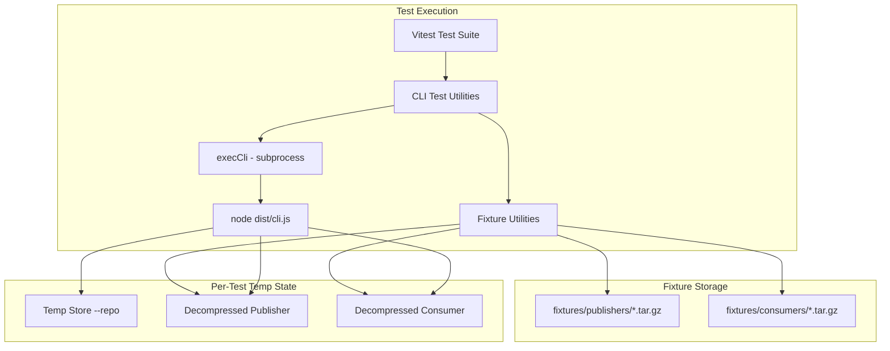
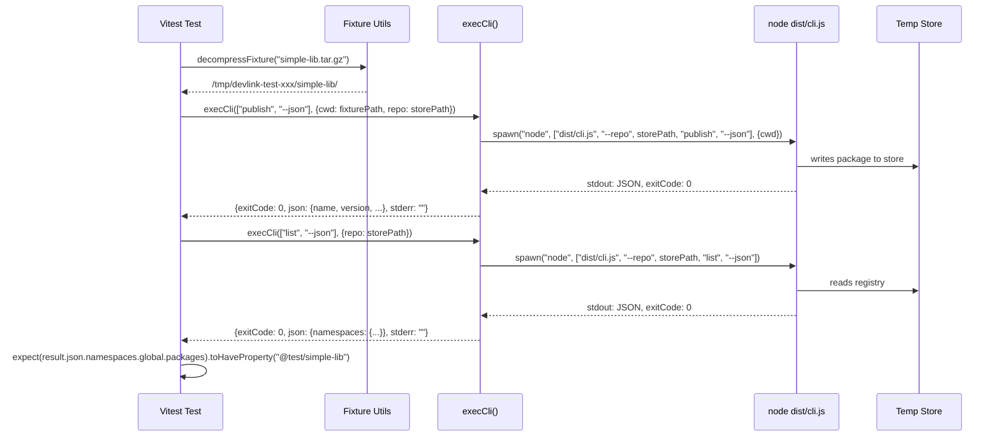
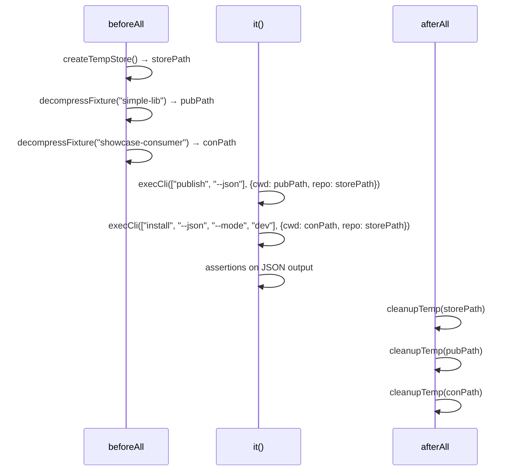

# Design Document: CLI Testing Infrastructure

## Overview

This design establishes a comprehensive CLI testing infrastructure for DevLink. It adds structured `--json` output to all pre-existing commands (publish, push, list, resolve, consumers, remove, verify, prune), creates a fixture-based integration test system that executes the compiled CLI binary as a subprocess, and documents the strategy in a steering file.

The testing approach is fundamentally different from existing unit tests: instead of importing handler functions and mocking internals, these tests execute `node dist/cli.js` as a child process — exactly as end users do. The store is isolated per test suite via `--repo <tempDir>`, and fixtures are tar.gz archives decompressed to temp directories for each test run. JSON output is the primary assertion mechanism.

## Architecture



## Sequence Diagrams

### Typical CLI Test Flow



### Fixture Lifecycle



## Components and Interfaces

### Component 1: JSON Output for Pre-Existing Commands

**Purpose**: Add `--json` flag to publish, push, list, resolve, consumers, remove, verify, and prune commands using the existing OutputRouter pattern.

Each command already has a core function that returns structured data (e.g., `publishPackage()` returns `PublishResult`, `verifyStore()` returns `VerifyResult`). The `--json` flag routes this data to stdout as JSON instead of formatting it for human consumption.

```typescript
// Pattern applied to each command's CLI handler:
// 1. Add --json option to Commander definition
// 2. Create OutputRouter based on --json flag
// 3. Route existing return value through router.json()

// Example: publish handler modification
export async function handlePublish(args: {
  namespace?: string;
  cwd?: string;
  json?: boolean;
}): Promise<void> {
  const router = createOutputRouter(!!args.json);
  const workingDir = args.cwd || process.cwd();
  const namespace = args.namespace || DEFAULT_NAMESPACE;

  try {
    const result = await publishPackage(workingDir, namespace);
    router.json(result);

    if (!args.json) {
      router.human(`✓ Published ${result.name}@${result.version}`);
      router.human(`  Namespace: ${result.namespace}`);
      router.human(`  Signature: ${result.signature.slice(0, 8)}`);
      router.human(`  Files: ${result.files}`);
    }
  } catch (error: any) {
    router.log(`✗ Publish failed: ${error.message}`);
    if (args.json) {
      process.stdout.write(JSON.stringify({ error: error.message }) + "\n");
    }
    process.exit(1);
  }
}
```

**JSON Output Schemas per Command:**

```typescript
// publish --json
interface PublishJsonOutput {
  name: string;
  version: string;
  namespace: string;
  signature: string;
  path: string;
  files: number;
}

// push --json
interface PushJsonOutput {
  published: PublishJsonOutput;
  consumersUpdated: string[];  // project paths
}

// list --json
interface ListJsonOutput {
  namespaces: Record<string, {
    packages: Record<string, {
      versions: Record<string, {
        signature: string;
        published: string;
        files: number;
      }>;
    }>;
  }>;
}

// resolve --json
interface ResolveJsonOutput {
  results: Array<{
    spec: string;
    name: string;
    version: string;
    resolved: boolean;
    namespace: string | null;
    path: string | null;
  }>;
}

// consumers --json
interface ConsumersJsonOutput {
  consumers: Array<{
    projectPath: string;
    packages: Array<{
      name: string;
      version: string;
      namespace: string;
    }>;
  }>;
  pruned?: string[];
}

// remove --json
interface RemoveJsonOutput {
  target: string;
  removed: Array<{
    name: string;
    version: string;
    namespace: string;
  }>;
  remainingVersions: number;
}

// verify --json
interface VerifyJsonOutput {
  valid: boolean;
  issues: Array<{
    type: "orphan-registry" | "orphan-disk" | "signature-mismatch";
    namespace: string;
    package: string;
    version: string;
  }>;
  fixed?: Array<{
    type: string;
    namespace: string;
    package: string;
    version: string;
  }>;
}

// prune --json
interface PruneJsonOutput {
  pruned: Array<{
    namespace: string;
    name: string;
    version: string;
    path: string;
  }>;
  dryRun: boolean;
}
```

### Component 2: Fixture Utilities

**Purpose**: Provide functions to decompress tar.gz fixtures to temp directories and clean them up after tests.

```typescript
// src/__tests__/helpers/fixtures.ts

import { mkdtemp, rm } from "fs/promises";
import { tmpdir } from "os";
import { join } from "path";
import { execSync } from "child_process";

const FIXTURES_DIR = join(__dirname, "../../../fixtures");
const PUBLISHERS_DIR = join(FIXTURES_DIR, "publishers");
const CONSUMERS_DIR = join(FIXTURES_DIR, "consumers");

/**
 * Decompress a publisher fixture to a unique temp directory.
 *
 * @param name - Fixture name without extension (e.g., "simple-lib")
 * @returns Absolute path to the decompressed fixture directory
 */
export async function decompressPublisher(name: string): Promise<string> {
  const archivePath = join(PUBLISHERS_DIR, `${name}.tar.gz`);
  const tempDir = await mkdtemp(join(tmpdir(), `devlink-pub-${name}-`));
  execSync(`tar -xzf "${archivePath}" -C "${tempDir}"`, { stdio: "pipe" });
  return tempDir;
}

/**
 * Decompress a consumer fixture to a unique temp directory.
 *
 * @param name - Fixture name without extension (e.g., "showcase-modes")
 * @returns Absolute path to the decompressed fixture directory
 */
export async function decompressConsumer(name: string): Promise<string> {
  const archivePath = join(CONSUMERS_DIR, `${name}.tar.gz`);
  const tempDir = await mkdtemp(join(tmpdir(), `devlink-con-${name}-`));
  execSync(`tar -xzf "${archivePath}" -C "${tempDir}"`, { stdio: "pipe" });
  return tempDir;
}

/**
 * Create a fresh temp directory for use as a store (--repo target).
 *
 * @returns Absolute path to the empty temp store directory
 */
export async function createTempStore(): Promise<string> {
  return mkdtemp(join(tmpdir(), "devlink-store-"));
}

/**
 * Remove a temp directory and all its contents.
 */
export async function cleanupTemp(dirPath: string): Promise<void> {
  await rm(dirPath, { recursive: true, force: true });
}
```

### Component 3: CLI Execution Utility

**Purpose**: Execute the compiled CLI binary as a subprocess with proper argument handling, store isolation, and JSON parsing.

```typescript
// src/__tests__/helpers/cli.ts

import { execFileSync, ExecFileSyncOptions } from "child_process";
import { join } from "path";

const CLI_PATH = join(__dirname, "../../../dist/cli.js");

export interface CliResult {
  exitCode: number;
  stdout: string;
  stderr: string;
  json: unknown | null;
}

export interface CliOptions {
  /** Working directory for the command */
  cwd?: string;
  /** Path to the temp store (passed as --repo) */
  repo: string;
  /** Environment variables to set */
  env?: Record<string, string>;
}

/**
 * Execute the DevLink CLI binary as a subprocess.
 *
 * Always includes --repo to isolate the store. Parses stdout as JSON
 * when the output looks like JSON (starts with { or [).
 *
 * @param args - CLI arguments (e.g., ["publish", "--json", "-n", "feature"])
 * @param options - Execution options (cwd, repo, env)
 * @returns Result with exitCode, stdout, stderr, and parsed json
 */
export function execCli(args: string[], options: CliOptions): CliResult {
  const fullArgs = ["--repo", options.repo, ...args];
  const execOptions: ExecFileSyncOptions = {
    cwd: options.cwd || process.cwd(),
    env: { ...process.env, ...options.env },
    encoding: "utf-8" as BufferEncoding,
    stdio: ["pipe", "pipe", "pipe"],
  };

  let stdout = "";
  let stderr = "";
  let exitCode = 0;

  try {
    const result = execFileSync("node", [CLI_PATH, ...fullArgs], execOptions);
    stdout = (result as unknown as string) || "";
  } catch (error: any) {
    exitCode = error.status ?? 1;
    stdout = error.stdout?.toString() || "";
    stderr = error.stderr?.toString() || "";
  }

  // Parse JSON if stdout looks like JSON
  let json: unknown | null = null;
  const trimmed = stdout.trim();
  if (trimmed.startsWith("{") || trimmed.startsWith("[")) {
    try {
      json = JSON.parse(trimmed);
    } catch {
      // Not valid JSON, leave as null
    }
  }

  return { exitCode, stdout, stderr, json };
}
```

### Component 4: Publisher Fixtures

**Purpose**: Pre-built package directories compressed as tar.gz, representing different types of publishable packages.

**Fixture Inventory:**

| Fixture Name | Description | Key Characteristics |
|---|---|---|
| `simple-lib` | Basic library package | name: `@test/simple-lib`, version: `1.0.0`, dist/ with index.js + index.d.ts |
| `simple-lib-v2` | Updated version of simple-lib | name: `@test/simple-lib`, version: `2.0.0`, additional exports |
| `lib-with-deps` | Library depending on another store package | name: `@test/lib-with-deps`, depends on `@test/simple-lib` in dependencies |
| `lib-with-bin` | Library with bin entries | name: `@test/cli-tool`, bin: { "my-tool": "dist/cli.js" } |
| `synthetic-pkg` | Package used as synthetic in consumer config | name: `@test/synthetic-sst`, peerDependencies on other packages |

**Directory structure inside each archive:**

```
simple-lib/
├── package.json
└── dist/
    ├── index.js
    └── index.d.ts
```

### Component 5: Consumer Fixtures

**Purpose**: Pre-built project directories compressed as tar.gz, representing different DevLink configuration patterns.

**Fixture Inventory:**

| Fixture Name | Description | Key Characteristics |
|---|---|---|
| `consumer-modes` | Monorepo with modes object config | modes.default: "dev", dev mode with manager: "store", packages referencing publisher fixtures |
| `consumer-legacy` | Project with legacy config (no modes) | Direct packages object, no modes, backward-compatible format |
| `consumer-multiworkspace` | Monorepo with multiple workspaces | package.json with workspaces array, nested package.json files |
| `consumer-synthetic` | Project with synthetic package config | packages with synthetic: true flag |

**Directory structure inside consumer-modes archive:**

```
consumer-modes/
├── package.json          (workspaces: ["packages/*"])
├── devlink.config.mjs    (modes object with default: "dev")
└── packages/
    └── app/
        └── package.json
```

**Example devlink.config.mjs for consumer-modes:**

```javascript
export default {
  devlink: {
    modes: {
      default: "dev",
      dev: () => ({ manager: "store" }),
    },
    packages: {
      "@test/simple-lib": { version: "1.0.0" },
      "@test/lib-with-deps": { version: "1.0.0" },
      "@test/synthetic-sst": { version: "1.0.0", synthetic: true },
    },
  },
};
```

### Component 6: Test Suites

**Purpose**: Integration test files organized by domain that exercise the CLI end-to-end.

**File Layout:**

```
src/__tests__/
├── helpers/
│   ├── cli.ts              # execCli utility
│   └── fixtures.ts         # decompressPublisher, decompressConsumer, createTempStore, cleanupTemp
├── cli-publish.spec.ts     # Publishing tests
├── cli-install.spec.ts     # Installation pipeline tests
├── cli-maintenance.spec.ts # Remove, verify, prune tests
└── cli-resolution.spec.ts  # Resolve, consumers tests
```

### Component 7: Steering File

**Purpose**: Document the fixture strategy, CLI test utility API, and patterns for AI agents.

**Location**: `.kiro/steering/cli-fixtures.md`

**Contents:**
- Fixture categories and naming conventions
- How to create new fixtures (directory structure → tar.gz)
- How to update existing fixtures
- CLI test utility API reference
- Complete test scenario examples
- Troubleshooting common issues

## Data Models

### Fixture Archive Format

Each fixture is a tar.gz archive containing a single top-level directory. The directory name matches the fixture name (without `.tar.gz` extension).

```
fixtures/
├── publishers/
│   ├── simple-lib.tar.gz        → contains simple-lib/
│   ├── simple-lib-v2.tar.gz     → contains simple-lib-v2/
│   ├── lib-with-deps.tar.gz     → contains lib-with-deps/
│   ├── lib-with-bin.tar.gz      → contains lib-with-bin/
│   └── synthetic-pkg.tar.gz     → contains synthetic-pkg/
└── consumers/
    ├── consumer-modes.tar.gz    → contains consumer-modes/
    ├── consumer-legacy.tar.gz   → contains consumer-legacy/
    ├── consumer-multiworkspace.tar.gz → contains consumer-multiworkspace/
    └── consumer-synthetic.tar.gz → contains consumer-synthetic/
```

### Test Temp Directory Layout

During test execution, each suite creates isolated temp directories:

```
/tmp/
├── devlink-store-abc123/          # Temp store (--repo target)
│   ├── namespaces/
│   │   └── global/
│   │       └── @test/simple-lib/1.0.0/
│   ├── registry.json
│   └── installations.json
├── devlink-pub-simple-lib-def456/ # Decompressed publisher
│   └── simple-lib/
│       ├── package.json
│       └── dist/
└── devlink-con-consumer-modes-ghi789/ # Decompressed consumer
    └── consumer-modes/
        ├── package.json
        ├── devlink.config.mjs
        └── packages/app/package.json
```

## Algorithmic Pseudocode

### CLI Test Execution Pattern

```typescript
/**
 * ALGORITHM: execCli
 *
 * Executes the DevLink CLI binary as a subprocess with store isolation.
 *
 * Preconditions:
 *   - dist/cli.js exists (project is built)
 *   - options.repo points to a valid temp directory
 *   - args is a non-empty array of CLI arguments
 *
 * Postconditions:
 *   - Returns CliResult with exitCode, stdout, stderr, and parsed json
 *   - Never throws — non-zero exit codes are captured in the result
 *   - If stdout is valid JSON, result.json contains the parsed object
 *   - If stdout is not JSON, result.json is null
 *
 * Side Effects:
 *   - May modify the temp store directory (publish, remove, prune)
 *   - May modify the consumer fixture directory (install, inject)
 */
function execCli(args: string[], options: CliOptions): CliResult {
  // 1. Prepend --repo to isolate store
  const fullArgs = ["--repo", options.repo, ...args];

  // 2. Execute as subprocess with piped stdio
  const { stdout, stderr, exitCode } = spawnSync("node", [CLI_PATH, ...fullArgs], {
    cwd: options.cwd,
    encoding: "utf-8",
  });

  // 3. Attempt JSON parse of stdout
  const json = tryParseJson(stdout.trim());

  return { exitCode, stdout, stderr, json };
}
```

### Fixture Decompression Pattern

```typescript
/**
 * ALGORITHM: decompressFixture
 *
 * Decompresses a tar.gz fixture to a unique temp directory.
 *
 * Preconditions:
 *   - archivePath exists and is a valid tar.gz file
 *   - The archive contains a single top-level directory
 *
 * Postconditions:
 *   - Returns path to a unique temp directory containing the decompressed fixture
 *   - The temp directory is unique per invocation (concurrent-safe)
 *   - The decompressed contents match the archive exactly
 *
 * Invariant:
 *   - Each call creates a new temp directory (never reuses)
 */
async function decompressFixture(category: string, name: string): Promise<string> {
  // 1. Resolve archive path
  const archivePath = join(FIXTURES_DIR, category, `${name}.tar.gz`);

  // 2. Create unique temp directory
  const tempDir = await mkdtemp(join(tmpdir(), `devlink-${category.slice(0, 3)}-${name}-`));

  // 3. Decompress archive to temp directory
  execSync(`tar -xzf "${archivePath}" -C "${tempDir}"`, { stdio: "pipe" });

  // 4. Return path (fixture contents are at tempDir/<name>/)
  return tempDir;
}
```

### Test Suite Lifecycle Pattern

```typescript
/**
 * ALGORITHM: testSuiteLifecycle
 *
 * Standard lifecycle for CLI integration test suites.
 *
 * Preconditions:
 *   - dist/cli.js is built and up to date
 *   - Fixture archives exist in fixtures/publishers/ and fixtures/consumers/
 *
 * Postconditions:
 *   - All temp directories are cleaned up after suite completes
 *   - No state leaks between test suites
 *   - Store is fresh for each suite (not shared between suites)
 */
describe("CLI: <domain>", () => {
  let storePath: string;
  let fixturePaths: string[] = [];

  beforeAll(async () => {
    // 1. Create isolated temp store
    storePath = await createTempStore();

    // 2. Decompress required fixtures
    const pubPath = await decompressPublisher("simple-lib");
    fixturePaths.push(pubPath);

    // 3. Pre-populate store if needed (publish fixtures)
    execCli(["publish", "--json"], { cwd: join(pubPath, "simple-lib"), repo: storePath });
  });

  afterAll(async () => {
    // Clean up all temp directories
    await cleanupTemp(storePath);
    for (const p of fixturePaths) {
      await cleanupTemp(p);
    }
  });

  it("should verify store state after publish", () => {
    const result = execCli(["list", "--json"], { repo: storePath });
    expect(result.exitCode).toBe(0);
    expect(result.json).toHaveProperty("namespaces.global.packages.@test/simple-lib");
  });
});
```

## Key Functions with Formal Specifications

### Function: execCli()

```typescript
function execCli(args: string[], options: CliOptions): CliResult
```

**Preconditions:**
- `dist/cli.js` exists at the expected path relative to the test file
- `options.repo` is a valid filesystem path (directory may or may not exist — CLI creates it)
- `args` contains at least one element (the command name)

**Postconditions:**
- Returns a `CliResult` object — never throws
- `exitCode` is the process exit code (0 for success, non-zero for failure)
- `stdout` contains the raw stdout string
- `stderr` contains the raw stderr string
- `json` is the parsed JSON object if stdout is valid JSON, otherwise null
- The subprocess has fully terminated before the function returns

### Function: decompressPublisher()

```typescript
async function decompressPublisher(name: string): Promise<string>
```

**Preconditions:**
- `fixtures/publishers/${name}.tar.gz` exists and is a valid gzip-compressed tar archive
- The archive contains a single top-level directory named `${name}/`

**Postconditions:**
- Returns the absolute path to a newly created temp directory
- The temp directory contains the decompressed archive contents
- The returned path is unique (safe for concurrent test execution)
- Throws if the archive doesn't exist or decompression fails

### Function: createTempStore()

```typescript
async function createTempStore(): Promise<string>
```

**Preconditions:** None

**Postconditions:**
- Returns the absolute path to a newly created empty temp directory
- The directory name includes "devlink-store" for identification
- The path is unique per invocation

### Function: cleanupTemp()

```typescript
async function cleanupTemp(dirPath: string): Promise<void>
```

**Preconditions:**
- `dirPath` is a valid filesystem path

**Postconditions:**
- The directory and all its contents are removed
- Does not throw if the directory doesn't exist (idempotent)

## Correctness Properties

### Property 1: JSON Output Isolation

*For any* pre-existing command executed with `--json`, stdout SHALL contain only a single valid JSON object (parseable by `JSON.parse`). All human-readable messages, progress indicators, and error descriptions SHALL be routed to stderr exclusively.

**Validates: Requirements 1, 2, 3, 4, 5, 6, 7, 8 (all JSON output requirements)**

### Property 2: JSON Output Backward Compatibility

*For any* pre-existing command executed WITHOUT `--json`, the output SHALL be identical to the output produced before this feature was implemented. Adding `--json` support SHALL NOT alter the default (non-JSON) behavior.

**Validates: Requirements 1.3, 2.2 (backward compatibility clauses)**

### Property 3: Fixture Decompression Isolation

*For any* two concurrent calls to `decompressPublisher` or `decompressConsumer` with the same fixture name, each call SHALL produce a unique temp directory path. The contents of one decompressed fixture SHALL NOT be affected by operations on another.

**Validates: Requirement 11.3 (concurrent safety)**

### Property 4: Store Isolation via --repo

*For any* CLI test execution using `execCli`, the command SHALL only read from and write to the temp store specified by `--repo`. The user's real store at `~/.devlink/` SHALL remain unmodified regardless of what operations the test performs.

**Validates: Requirement 12.2 (store isolation)**

### Property 5: CLI Result Completeness

*For any* CLI execution (success or failure), `execCli` SHALL return a complete `CliResult` with exitCode, stdout, stderr, and json fields. Non-zero exit codes SHALL NOT cause the utility to throw — they are captured in the result for assertion.

**Validates: Requirement 12.5 (no-throw on error)**

### Property 6: Publish Round-Trip Verifiability

*For any* publisher fixture published via `publish --json`, the resulting store state SHALL be verifiable via `list --json`. The package name, version, and namespace in the publish output SHALL appear in the list output's registry structure.

**Validates: Requirement 13.1 (publish → list verification)**

### Property 7: Fixture Archive Determinism

*For any* fixture archive, decompressing it multiple times SHALL produce byte-identical directory contents. The archive format (tar.gz) is deterministic — same input always produces same output when decompressed.

**Validates: Requirement 9.3, 10.3 (fixture reproducibility)**

### Property 8: Prune Dry-Run Immutability

*For any* store state, executing `prune --dry-run --json` SHALL produce output listing orphans but SHALL NOT modify any files on disk. A subsequent `list --json` SHALL show the same packages as before the dry-run.

**Validates: Requirement 8.2 (dry-run safety)**

## Error Handling

### Error Scenario 1: CLI Binary Not Built

**Condition**: `dist/cli.js` does not exist when tests run
**Response**: `execCli` throws with a clear error: "CLI binary not found at dist/cli.js. Run 'npm run build' first."
**Recovery**: Run `npm run build` before executing tests

### Error Scenario 2: Fixture Archive Missing

**Condition**: Requested fixture tar.gz does not exist
**Response**: `decompressPublisher`/`decompressConsumer` throws with error naming the missing archive path
**Recovery**: Create the fixture or fix the fixture name in the test

### Error Scenario 3: Temp Directory Cleanup Failure

**Condition**: `cleanupTemp` cannot remove a directory (permissions, open handles)
**Response**: Logs a warning but does not fail the test suite. OS temp cleanup will handle it eventually.
**Recovery**: Manual cleanup or OS reboot clears temp directories

### Error Scenario 4: JSON Parse Failure in CLI Output

**Condition**: Command with `--json` produces invalid JSON on stdout (bug in implementation)
**Response**: `execCli` returns `json: null` and the raw stdout string. Test can assert on `result.json` being null to detect the issue.
**Recovery**: Fix the command's JSON output implementation

## File Changes Summary

### New Files

| File | Purpose |
|------|---------|
| `src/__tests__/helpers/cli.ts` | CLI execution utility (execCli) |
| `src/__tests__/helpers/fixtures.ts` | Fixture decompression and cleanup utilities |
| `src/__tests__/cli-publish.spec.ts` | Publishing CLI integration tests |
| `src/__tests__/cli-install.spec.ts` | Installation pipeline CLI tests |
| `src/__tests__/cli-maintenance.spec.ts` | Remove, verify, prune CLI tests |
| `src/__tests__/cli-resolution.spec.ts` | Resolve, consumers CLI tests |
| `fixtures/publishers/simple-lib.tar.gz` | Simple library fixture |
| `fixtures/publishers/simple-lib-v2.tar.gz` | Updated library fixture |
| `fixtures/publishers/lib-with-deps.tar.gz` | Library with internal deps fixture |
| `fixtures/publishers/lib-with-bin.tar.gz` | Library with bin entries fixture |
| `fixtures/publishers/synthetic-pkg.tar.gz` | Synthetic package fixture |
| `fixtures/consumers/consumer-modes.tar.gz` | Modes config consumer fixture |
| `fixtures/consumers/consumer-legacy.tar.gz` | Legacy config consumer fixture |
| `fixtures/consumers/consumer-multiworkspace.tar.gz` | Multi-workspace consumer fixture |
| `fixtures/consumers/consumer-synthetic.tar.gz` | Synthetic package consumer fixture |
| `.kiro/steering/cli-fixtures.md` | Steering file documenting fixture strategy |

### Modified Files

| File | Change |
|------|--------|
| `src/cli.ts` | Add `--json` option to publish, push, list, resolve, consumers, remove, verify, prune commands |
| `src/commands/publish.ts` | Add `json` parameter to `handlePublish`, use OutputRouter |
| `src/commands/push.ts` | Add `json` parameter to `handlePush`, use OutputRouter |
| `src/commands/list.ts` | Add `json` parameter to `handleList`, return registry data as JSON |
| `src/commands/resolve.ts` | Add `json` parameter to `handleResolve`, return resolution results as JSON |
| `src/commands/consumers.ts` | Add `json` parameter to `handleConsumers`, use OutputRouter |
| `src/commands/remove.ts` | Add `json` parameter to `handleRemove`, use OutputRouter |
| `src/commands/verify.ts` | Add `json` parameter to `handleVerify`, use OutputRouter |
| `src/commands/prune.ts` | Add `json` parameter to `handlePrune`, use OutputRouter |
| `vitest.config.ts` | Optionally add CLI test pattern if not already covered |
