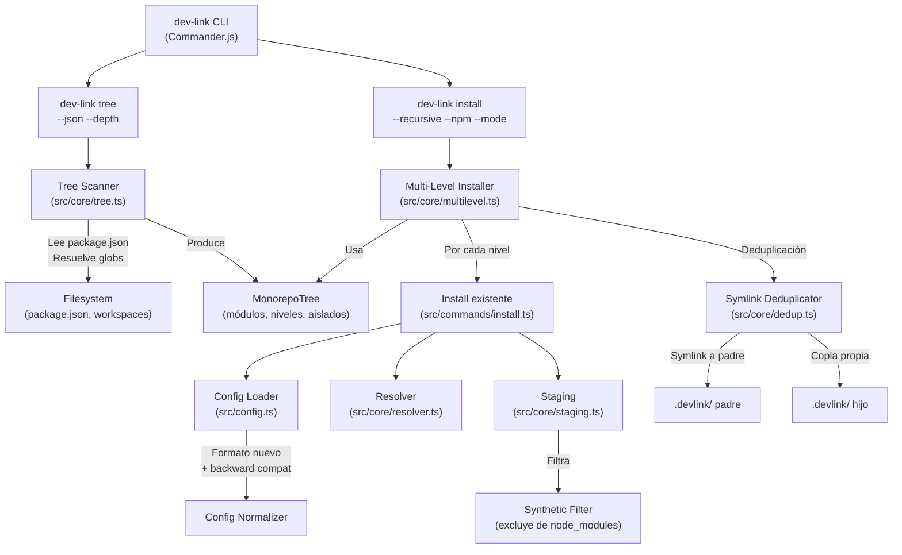
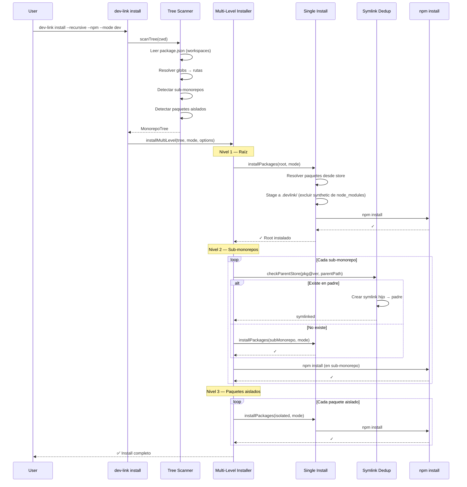
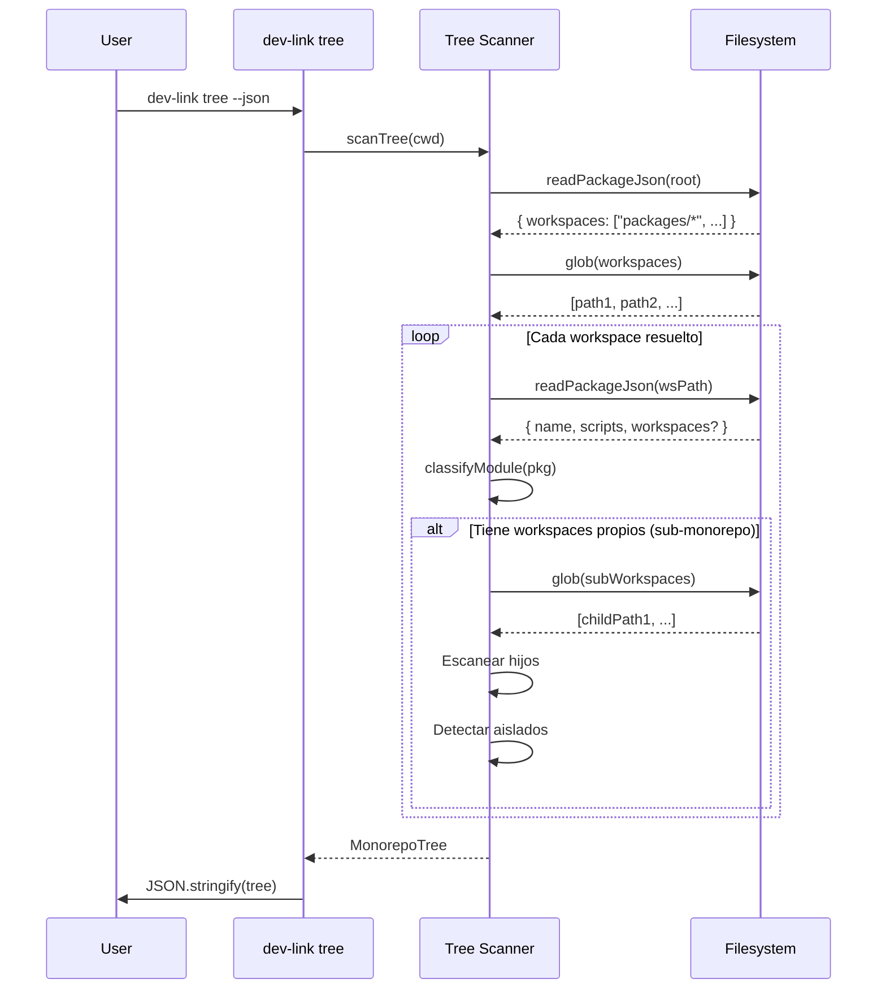
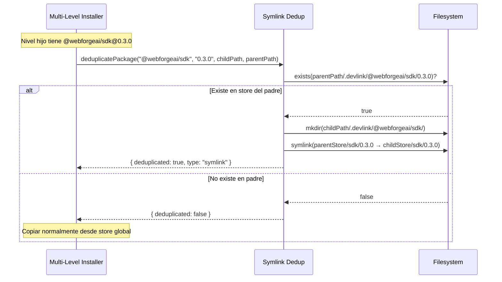

# Documento de Diseño: devlink-monorepo-support

## Resumen

DevLink actualmente opera en un solo nivel: carga un `devlink.config.mjs`, resuelve paquetes desde el store global (`~/.devlink`), los copia/inyecta en `node_modules` o `.devlink/` local, y ejecuta `npm install`. Este modelo funciona para proyectos simples pero no soporta monorepos multinivel donde existen sub-monorepos con sus propios workspaces, paquetes aislados fuera de globs de workspace, y configuraciones DevLink independientes en distintos niveles.

Este diseño extiende DevLink con cuatro capacidades nuevas: (1) un tree scanner que descubre y clasifica la estructura completa de un monorepo recursivamente, (2) instalación multinivel que ejecuta `dev-link install` en cada nivel respetando orden y fail-fast, (3) deduplicación por symlinks entre stores padre-hijo para evitar copias redundantes del mismo paquete@versión, y (4) soporte para paquetes sintéticos que se resuelven al store pero no se instalan en `node_modules`. Además, el formato de configuración evoluciona para soportar el campo `synthetic` manteniendo compatibilidad con el formato actual.

El diseño se origina del spec `webforgeai install`, donde se identificó que DevLink debe absorber las responsabilidades de tree scanning e instalación multinivel en lugar de reimplementarlas en el CLI de WebForge.AI. El tree scanner se expone como comando `dev-link tree` con salida JSON para consumo por herramientas externas.

## Arquitectura



## Diagramas de Secuencia

### Flujo Principal: `dev-link install --recursive --npm --mode dev`



### Flujo: `dev-link tree --json`



### Flujo: Deduplicación por Symlinks




## Componentes e Interfaces

### Componente 1: Tree Scanner (`src/core/tree.ts`)

**Propósito**: Descubrir y clasificar la estructura completa de un monorepo recursivamente. Produce un árbol genérico (tool-agnostic) que expone scripts y metadata sin hardcodear campos específicos de SST u otras herramientas.

**Interfaz**:
```typescript
/** Tipo de módulo inferido por heurísticas */
type ModuleType = 'library' | 'infrastructure' | 'service' | 'app' | 'unknown';

/** Módulo descubierto en el monorepo */
interface MonorepoModule {
  name: string;              // nombre del package.json
  path: string;              // ruta absoluta
  relativePath: string;      // ruta relativa a la raíz del monorepo
  type: ModuleType;          // clasificación por heurísticas
  hasWorkspaces: boolean;    // tiene campo workspaces en package.json
  isIsolated: boolean;       // no pertenece a ningún workspace glob del padre
  scripts: string[];         // nombres de scripts disponibles (ej: ["build", "sst:install"])
  hasDevlinkConfig: boolean; // tiene devlink.config.mjs en su directorio
  children: MonorepoModule[];
}

/** Nivel de instalación (dónde ejecutar npm install / dev-link install) */
interface InstallLevel {
  path: string;              // ruta absoluta
  relativePath: string;      // ruta relativa a la raíz
  hasDevlinkConfig: boolean; // tiene config DevLink propia
  workspaces: string[];      // globs de workspaces del package.json
}

/** Árbol completo del monorepo */
interface MonorepoTree {
  root: string;                    // ruta absoluta de la raíz
  modules: MonorepoModule[];      // módulos de primer nivel
  installLevels: InstallLevel[];   // niveles ordenados para instalación
  isolatedPackages: string[];      // rutas absolutas de paquetes aislados
}

/** Opciones del scanner */
interface ScanOptions {
  maxDepth?: number;   // profundidad máxima de recursión (default: 3)
}

// Función principal
function scanTree(rootDir: string, options?: ScanOptions): Promise<MonorepoTree>;
```

**Responsabilidades**:
- Leer `package.json` en la raíz para obtener workspaces
- Resolver globs de workspaces a rutas concretas usando `fs.glob` (Node 22+)
- Recorrer cada workspace y detectar sub-monorepos (package.json con workspaces propios)
- Identificar paquetes aislados: directorios con `package.json` dentro de un sub-monorepo que NO están cubiertos por los globs de workspace del padre
- Clasificar módulos por tipo usando heurísticas (scripts, path patterns)
- Detectar presencia de `devlink.config.mjs` en cada nivel
- Producir niveles de instalación ordenados: raíz → sub-monorepos → aislados
- Exponer scripts genéricos (no hardcodear campos como `hasSstInstall`)

### Componente 2: Multi-Level Installer (`src/core/multilevel.ts`)

**Propósito**: Orquestar la instalación de dependencias en cada nivel del monorepo, respetando orden y fail-fast.

**Interfaz**:
```typescript
interface MultiLevelInstallOptions {
  tree: MonorepoTree;
  mode: string;
  runNpm: boolean;
  runScripts?: boolean;
  config?: string;       // path explícito a config (override)
}

interface LevelResult {
  path: string;
  relativePath: string;
  success: boolean;
  duration: number;
  hasDevlinkConfig: boolean;
  error?: string;
}

interface MultiLevelInstallResult {
  levels: LevelResult[];
  totalDuration: number;
  success: boolean;
}

// Función principal
async function installMultiLevel(
  options: MultiLevelInstallOptions
): Promise<MultiLevelInstallResult>;
```

**Responsabilidades**:
- Ejecutar `installPackages()` en la raíz del monorepo (nivel 1)
- Para cada sub-monorepo con config DevLink: ejecutar `installPackages()` con su config propia
- Para cada sub-monorepo sin config DevLink: ejecutar solo `npm install`
- Para cada paquete aislado: ejecutar `installPackages()` si tiene config, sino `npm install`
- Antes de instalar en un nivel hijo, ejecutar deduplicación por symlinks
- Fail-fast: si un nivel falla, no ejecutar niveles posteriores
- Reportar progreso y duración por nivel

### Componente 3: Symlink Deduplicator (`src/core/dedup.ts`)

**Propósito**: Evitar copias redundantes del mismo paquete@versión entre stores padre-hijo creando symlinks.

**Interfaz**:
```typescript
interface DeduplicationResult {
  packageName: string;
  version: string;
  deduplicated: boolean;
  type: 'symlink' | 'copy';
  sourcePath: string;    // de dónde viene (padre o store global)
  targetPath: string;    // dónde se colocó
}

interface DeduplicationOptions {
  parentStorePath: string;   // ruta al .devlink/ del padre
  childStorePath: string;    // ruta al .devlink/ del hijo
  packages: { name: string; version: string }[];
}

// Función principal
async function deduplicatePackages(
  options: DeduplicationOptions
): Promise<DeduplicationResult[]>;
```

**Responsabilidades**:
- Para cada paquete@versión declarado en el nivel hijo, verificar si existe en el store del padre
- Si existe en padre: crear symlink en `childStore/{name}/{version}` → `parentStore/{name}/{version}`
- Si no existe en padre: no deduplicar (se copiará normalmente desde el store global)
- Solo deduplicar en relación padre-hijo (no entre siblings)
- Crear directorios intermedios necesarios para scoped packages (`@scope/`)

### Componente 4: Config Normalizer (extensión de `src/config.ts`)

**Propósito**: Soportar el nuevo formato de configuración con `synthetic` y `version` anidado, manteniendo compatibilidad con el formato actual.

**Interfaz**:
```typescript
/** Formato nuevo de paquete en config */
interface PackageSpecNew {
  version: Record<string, string>;  // { dev: "0.3.0", remote: "0.3.0" }
  synthetic?: boolean;
}

/** Formato legacy (actual) */
interface PackageSpecLegacy {
  [mode: string]: string;  // { dev: "0.3.0", remote: "0.3.0" }
}

/** Formato unificado interno */
interface NormalizedPackageSpec {
  versions: Record<string, string>;
  synthetic: boolean;
}

/** Config normalizada */
interface NormalizedConfig {
  packages: Record<string, NormalizedPackageSpec>;
  modes: Record<string, ModeConfig>;
}

// Función principal
function normalizeConfig(raw: DevLinkConfig): NormalizedConfig;

// Detección de formato
function isNewFormat(spec: unknown): spec is PackageSpecNew;
function isLegacyFormat(spec: unknown): spec is PackageSpecLegacy;
```

**Responsabilidades**:
- Detectar si un paquete usa formato nuevo (`{ version: {...}, synthetic?: true }`) o legacy (`{ dev: "0.3.0" }`)
- Normalizar ambos formatos a una estructura interna unificada
- Extraer mode factories del config (propiedades que son funciones)
- Ignorar `detectMode` si existe (deprecado, modo siempre viene del CLI)
- Validar que al menos un paquete y un modo estén definidos

### Componente 5: Tree Command (`src/commands/tree.ts`)

**Propósito**: Exponer el tree scanner como comando CLI con salida humana y JSON.

**Interfaz**:
```typescript
interface TreeCommandOptions {
  json?: boolean;      // salida JSON para consumo por herramientas
  depth?: number;      // profundidad máxima de escaneo
}

// Handler del comando
async function handleTree(options: TreeCommandOptions): Promise<void>;
```

**Responsabilidades**:
- Invocar `scanTree()` desde el directorio actual
- En modo `--json`: imprimir el `MonorepoTree` como JSON a stdout
- En modo normal: imprimir árbol visual con clasificación de módulos
- Mostrar resumen: cantidad de módulos, niveles de instalación, paquetes aislados

## Modelos de Datos

### Modelo 1: Formato de Configuración (nuevo con backward compat)

```typescript
// Formato NUEVO (recomendado)
const configNew = {
  packages: {
    "@webforgeai/sdk": {
      version: { dev: "0.3.0", remote: "0.3.0" },
    },
    "@webforgeai/sst": {
      version: { dev: "0.3.0", remote: "0.3.0" },
      synthetic: true,  // solo store, no node_modules
    },
  },
  // Mode factories como propiedades top-level (sin cambios)
  dev: (ctx) => ({ manager: "store", namespaces: ["global"] }),
  remote: (ctx) => ({ manager: "npm", args: ["--no-save"] }),
};

// Formato LEGACY (sigue funcionando)
const configLegacy = {
  packages: {
    "@webforgeai/sdk": { dev: "0.3.0", remote: "0.3.0" },
  },
  dev: (ctx) => ({ manager: "store", namespaces: ["global"] }),
  remote: (ctx) => ({ manager: "npm", args: ["--no-save"] }),
  detectMode: (ctx) => { /* deprecado, ignorado */ },
};
```

**Reglas de Validación**:
- `packages` es requerido y debe tener al menos un paquete
- Formato nuevo: `version` debe ser un objeto con al menos un modo
- Formato legacy: al menos una propiedad string (modo → versión)
- `synthetic` es opcional, default `false`
- Al menos una mode factory debe existir como propiedad top-level
- `detectMode` se ignora si existe (deprecado)

**Regla de Detección de Formato**:
- Si un paquete tiene propiedad `version` que es un objeto → formato nuevo
- Si un paquete tiene propiedades string directas (ej: `dev: "0.3.0"`) → formato legacy
- No se permite mezclar formatos dentro del mismo config

### Modelo 2: MonorepoTree (salida del scanner)

```typescript
// Ejemplo para el monorepo HCAMSWS
const tree: MonorepoTree = {
  root: "/path/to/mastertech.hcamsws",
  modules: [
    {
      name: "@mastertech/hcamsws.libs.core",
      path: "/path/to/packages/libs/node/core",
      relativePath: "packages/libs/node/core",
      type: "library",
      hasWorkspaces: false,
      isIsolated: false,
      scripts: ["build", "prewatch", "watch"],
      hasDevlinkConfig: false,
      children: [],
    },
    {
      name: "@mastertech/hcamsws.cloud.core",
      path: "/path/to/packages/cloud/core",
      relativePath: "packages/cloud/core",
      type: "infrastructure",
      hasWorkspaces: false,
      isIsolated: false,
      scripts: ["cloud.core", "sst:install", "sst:dev", "sst:deploy"],
      hasDevlinkConfig: false,
      children: [],
    },
    {
      name: "@mastertech/hcamsws.srv.web",
      path: "/path/to/packages/services/web",
      relativePath: "packages/services/web",
      type: "service",
      hasWorkspaces: true,
      isIsolated: false,
      scripts: ["srv.web", "build", "sst:install"],
      hasDevlinkConfig: false,
      children: [
        {
          name: "connector",
          path: "/path/to/packages/services/web/packages/connector",
          relativePath: "packages/services/web/packages/connector",
          type: "infrastructure",
          hasWorkspaces: false,
          isIsolated: false,
          scripts: ["sst:install", "sst:dev"],
          hasDevlinkConfig: false,
          children: [],
        },
        {
          name: "service",
          path: "/path/to/packages/services/web/packages/service",
          relativePath: "packages/services/web/packages/service",
          type: "service",
          hasWorkspaces: false,
          isIsolated: false,
          scripts: ["build"],
          hasDevlinkConfig: false,
          children: [],
        },
      ],
    },
    {
      name: "@mastertech/hcamsws.app.web",
      path: "/path/to/packages/apps/web",
      relativePath: "packages/apps/web",
      type: "app",
      hasWorkspaces: true,
      isIsolated: false,
      scripts: ["app.web", "build", "sst:install"],
      hasDevlinkConfig: false,
      children: [
        {
          name: "connector",
          path: "/path/to/packages/apps/web/packages/connector",
          relativePath: "packages/apps/web/packages/connector",
          type: "infrastructure",
          hasWorkspaces: false,
          isIsolated: false,
          scripts: ["sst:install"],
          hasDevlinkConfig: false,
          children: [],
        },
        {
          name: "app",
          path: "/path/to/packages/apps/web/packages/app",
          relativePath: "packages/apps/web/packages/app",
          type: "app",
          hasWorkspaces: false,
          isIsolated: true,  // NO está en workspace glob "packages/connector"
          scripts: ["build", "dev"],
          hasDevlinkConfig: false,
          children: [],
        },
      ],
    },
  ],
  installLevels: [
    {
      path: "/path/to/mastertech.hcamsws",
      relativePath: ".",
      hasDevlinkConfig: true,
      workspaces: ["packages/apps/web", "packages/cloud/*", "packages/libs/node/*", "packages/services/*"],
    },
    {
      path: "/path/to/packages/services/web",
      relativePath: "packages/services/web",
      hasDevlinkConfig: false,
      workspaces: ["packages/*"],
    },
    {
      path: "/path/to/packages/services/data",
      relativePath: "packages/services/data",
      hasDevlinkConfig: false,
      workspaces: ["packages/*"],
    },
    {
      path: "/path/to/packages/apps/web",
      relativePath: "packages/apps/web",
      hasDevlinkConfig: false,
      workspaces: ["packages/connector"],
    },
  ],
  isolatedPackages: [
    "/path/to/packages/apps/web/packages/app",
  ],
};
```

### Modelo 3: Resultado de Deduplicación

```typescript
// Ejemplo: sub-monorepo srv.web hereda @webforgeai/sdk@0.3.0 del root
const dedupResults: DeduplicationResult[] = [
  {
    packageName: "@webforgeai/sdk",
    version: "0.3.0",
    deduplicated: true,
    type: "symlink",
    sourcePath: "/root/.devlink/@webforgeai/sdk/0.3.0",
    targetPath: "/root/packages/services/web/.devlink/@webforgeai/sdk/0.3.0",
  },
  {
    packageName: "@custom/lib",
    version: "1.0.0",
    deduplicated: false,
    type: "copy",
    sourcePath: "~/.devlink/namespaces/global/@custom/lib/1.0.0",
    targetPath: "/root/packages/services/web/.devlink/@custom/lib/1.0.0",
  },
];
```

## Pseudocódigo Algorítmico

### Algoritmo: Tree Scanner

```typescript
async function scanTree(rootDir: string, options?: ScanOptions): Promise<MonorepoTree> {
  const maxDepth = options?.maxDepth ?? 3;
  const rootPkg = await readPackageJson(rootDir);
  assert(rootPkg !== null, "Root package.json must exist");

  const modules: MonorepoModule[] = [];
  const installLevels: InstallLevel[] = [];
  const isolatedPackages: string[] = [];

  // Registrar nivel raíz
  const rootWorkspaces: string[] = rootPkg.workspaces ?? [];
  const rootHasConfig = await hasDevlinkConfig(rootDir);
  installLevels.push({
    path: rootDir,
    relativePath: ".",
    hasDevlinkConfig: rootHasConfig,
    workspaces: rootWorkspaces,
  });

  // Resolver globs de workspaces a rutas concretas
  const resolvedPaths = await resolveWorkspaceGlobs(rootDir, rootWorkspaces);

  for (const wsPath of resolvedPaths) {
    const module = await scanModule(wsPath, rootDir, resolvedPaths);
    modules.push(module);

    // Si el módulo tiene workspaces propios → es sub-monorepo
    if (module.hasWorkspaces && maxDepth > 1) {
      const subPkg = await readPackageJson(wsPath);
      const subWorkspaces: string[] = subPkg.workspaces ?? [];
      const subHasConfig = await hasDevlinkConfig(wsPath);

      installLevels.push({
        path: wsPath,
        relativePath: path.relative(rootDir, wsPath),
        hasDevlinkConfig: subHasConfig,
        workspaces: subWorkspaces,
      });

      const subResolvedPaths = await resolveWorkspaceGlobs(wsPath, subWorkspaces);

      // Listar TODOS los subdirectorios con package.json
      const allSubPackages = await listSubPackages(wsPath);

      for (const childPath of allSubPackages) {
        const child = await scanModule(childPath, rootDir, subResolvedPaths);
        module.children.push(child);

        // Detectar paquete aislado
        if (!isPathInResolvedGlobs(childPath, subResolvedPaths)) {
          child.isIsolated = true;
          isolatedPackages.push(childPath);
        }
      }
    }
  }

  return { root: rootDir, modules, installLevels, isolatedPackages };
}
```

**Precondiciones:**
- `rootDir` contiene un `package.json` válido
- Los globs de workspaces son resolubles a directorios existentes
- Node.js >= 22 (para `fs.glob`)

**Postcondiciones:**
- `tree.modules` contiene todos los módulos del monorepo (sin duplicados)
- `tree.installLevels[0].path === rootDir` (raíz siempre primero)
- `tree.isolatedPackages` contiene solo paquetes que no pertenecen a ningún workspace glob
- Cada módulo tiene `type`, `scripts`, `hasDevlinkConfig` asignados

**Invariantes de Loop:**
- Cada directorio con `package.json` se escanea exactamente una vez
- Los hijos solo se escanean si el padre tiene workspaces y `depth < maxDepth`

### Algoritmo: Clasificación de Módulos

```typescript
function classifyModule(
  pkg: PackageManifest,
  modulePath: string,
  rootDir: string
): ModuleType {
  const scripts = pkg.scripts ?? {};
  const relativePath = path.relative(rootDir, modulePath);

  // Heurística 1: Scripts de infraestructura sin build → infrastructure
  if (scripts["sst:dev"] && !scripts["build"]) return "infrastructure";
  if (scripts["sst:install"] && !scripts["build"]) return "infrastructure";

  // Heurística 2: Path patterns
  if (relativePath.includes("/libs/") || relativePath.includes("/lib/")) return "library";
  if (relativePath.includes("/services/") || relativePath.includes("/service/")) return "service";
  if (relativePath.includes("/apps/") || relativePath.includes("/app/")) return "app";
  if (relativePath.includes("/cloud/") || relativePath.includes("/infra/")) return "infrastructure";

  // Heurística 3: Nombre del paquete
  if (pkg.name?.includes(".libs.") || pkg.name?.includes("-lib")) return "library";
  if (pkg.name?.includes(".srv.") || pkg.name?.includes("-service")) return "service";
  if (pkg.name?.includes(".app.") || pkg.name?.includes("-app")) return "app";

  // Heurística 4: Nombre del directorio (para hijos de sub-monorepos)
  const dirName = path.basename(modulePath);
  if (dirName === "connector") return "infrastructure";
  if (dirName === "service") return "service";
  if (dirName === "app") return "app";

  return "unknown";
}
```

**Precondiciones:**
- `pkg` es un objeto válido de `package.json`
- `modulePath` es una ruta absoluta existente

**Postcondiciones:**
- Retorna un `ModuleType` válido
- La clasificación es determinista para los mismos inputs

### Algoritmo: Detección de Paquetes Aislados

```typescript
async function listSubPackages(parentDir: string): Promise<string[]> {
  // Buscar todos los directorios inmediatos que contengan package.json
  // dentro de subdirectorios conocidos (ej: packages/)
  const results: string[] = [];
  const packagesDir = path.join(parentDir, "packages");

  try {
    const entries = await fs.readdir(packagesDir, { withFileTypes: true });
    for (const entry of entries) {
      if (!entry.isDirectory()) continue;
      const candidatePath = path.join(packagesDir, entry.name);
      if (await fileExists(path.join(candidatePath, "package.json"))) {
        results.push(candidatePath);
      }
    }
  } catch {
    // No packages/ directory — no sub-packages
  }

  return results;
}

function isPathInResolvedGlobs(
  targetPath: string,
  resolvedPaths: string[]
): boolean {
  const normalized = path.resolve(targetPath);
  return resolvedPaths.some(p => path.resolve(p) === normalized);
}
```

**Precondiciones:**
- `parentDir` es un directorio existente (sub-monorepo)

**Postcondiciones:**
- Retorna rutas absolutas de todos los subdirectorios con `package.json`
- `isPathInResolvedGlobs` retorna `true` sii el path está en la lista de globs resueltos

### Algoritmo: Instalación Multinivel

```typescript
async function installMultiLevel(
  options: MultiLevelInstallOptions
): Promise<MultiLevelInstallResult> {
  const { tree, mode, runNpm, runScripts, config } = options;
  const results: LevelResult[] = [];
  const startTime = Date.now();

  // Fase 1: Raíz (siempre primero)
  const rootLevel = tree.installLevels[0];
  assert(rootLevel.path === tree.root, "First level must be root");

  const rootResult = await installAtLevel(rootLevel, mode, runNpm, runScripts, config);
  results.push(rootResult);
  if (!rootResult.success) {
    return { levels: results, totalDuration: Date.now() - startTime, success: false };
  }

  // Fase 2: Sub-monorepos (secuencial)
  for (const level of tree.installLevels.slice(1)) {
    // Deduplicar paquetes del padre antes de instalar
    if (level.hasDevlinkConfig) {
      await deduplicateFromParent(tree.root, level.path, mode);
    }

    const levelResult = await installAtLevel(level, mode, runNpm, runScripts, config);
    results.push(levelResult);
    if (!levelResult.success) {
      return { levels: results, totalDuration: Date.now() - startTime, success: false };
    }
  }

  // Fase 3: Paquetes aislados (secuencial)
  for (const isoPath of tree.isolatedPackages) {
    const isoHasConfig = await hasDevlinkConfig(isoPath);
    const isoLevel: InstallLevel = {
      path: isoPath,
      relativePath: path.relative(tree.root, isoPath),
      hasDevlinkConfig: isoHasConfig,
      workspaces: [],
    };

    const isoResult = await installAtLevel(isoLevel, mode, runNpm, runScripts, config);
    results.push(isoResult);
    if (!isoResult.success) {
      return { levels: results, totalDuration: Date.now() - startTime, success: false };
    }
  }

  return { levels: results, totalDuration: Date.now() - startTime, success: true };
}

async function installAtLevel(
  level: InstallLevel,
  mode: string,
  runNpm: boolean,
  runScripts?: boolean,
  configOverride?: string
): Promise<LevelResult> {
  const startTime = Date.now();

  try {
    // Cambiar al directorio del nivel
    const originalCwd = process.cwd();
    process.chdir(level.path);

    try {
      if (level.hasDevlinkConfig) {
        // Tiene config DevLink → ejecutar install completo
        await installPackages({
          mode,
          runNpm,
          runScripts,
          config: configOverride,
        });
      } else if (runNpm) {
        // Sin config DevLink → solo npm install
        await runNpmInstall(runScripts);
      }

      return {
        path: level.path,
        relativePath: level.relativePath,
        success: true,
        duration: Date.now() - startTime,
        hasDevlinkConfig: level.hasDevlinkConfig,
      };
    } finally {
      process.chdir(originalCwd);
    }
  } catch (error: any) {
    return {
      path: level.path,
      relativePath: level.relativePath,
      success: false,
      duration: Date.now() - startTime,
      hasDevlinkConfig: level.hasDevlinkConfig,
      error: error.message,
    };
  }
}
```

**Precondiciones:**
- `tree` es un `MonorepoTree` válido producido por `scanTree`
- `mode` es un modo válido definido en la config
- Si `runNpm` es true, npm está disponible en PATH

**Postcondiciones:**
- Si `success: true`: todas las dependencias están instaladas en todos los niveles
- Los niveles se procesan en orden: raíz → sub-monorepos → aislados
- Si un nivel falla, los niveles posteriores NO se ejecutan (fail-fast)
- Cada resultado incluye `duration` en milisegundos

**Invariantes de Loop:**
- Todos los niveles procesados hasta el momento fueron exitosos
- El directorio de trabajo se restaura siempre (finally)

### Algoritmo: Deduplicación por Symlinks

```typescript
async function deduplicatePackages(
  options: DeduplicationOptions
): Promise<DeduplicationResult[]> {
  const { parentStorePath, childStorePath, packages } = options;
  const results: DeduplicationResult[] = [];

  for (const pkg of packages) {
    const parentPkgPath = path.join(parentStorePath, pkg.name, pkg.version);
    const childPkgPath = path.join(childStorePath, pkg.name, pkg.version);

    // Verificar si existe en el store del padre
    const existsInParent = await fileExists(path.join(parentPkgPath, "package.json"));

    if (existsInParent) {
      // Crear symlink: hijo → padre
      await fs.mkdir(path.dirname(childPkgPath), { recursive: true });
      await fs.rm(childPkgPath, { recursive: true, force: true });
      await fs.symlink(parentPkgPath, childPkgPath, "dir");

      results.push({
        packageName: pkg.name,
        version: pkg.version,
        deduplicated: true,
        type: "symlink",
        sourcePath: parentPkgPath,
        targetPath: childPkgPath,
      });
    } else {
      results.push({
        packageName: pkg.name,
        version: pkg.version,
        deduplicated: false,
        type: "copy",
        sourcePath: "",
        targetPath: childPkgPath,
      });
    }
  }

  return results;
}

async function deduplicateFromParent(
  rootDir: string,
  childDir: string,
  mode: string
): Promise<DeduplicationResult[]> {
  const childConfig = await tryLoadConfig(childDir);
  if (!childConfig) return [];

  const normalized = normalizeConfig(childConfig);
  const packages = Object.entries(normalized.packages)
    .filter(([_, spec]) => spec.versions[mode])
    .map(([name, spec]) => ({ name, version: spec.versions[mode] }));

  if (packages.length === 0) return [];

  // Buscar el store del padre más cercano (scan upward desde childDir)
  const parentStorePath = await findNearestParentStore(childDir, rootDir);
  if (!parentStorePath) return [];

  const childStorePath = path.join(childDir, ".devlink");

  return deduplicatePackages({
    parentStorePath,
    childStorePath,
    packages,
  });
}

async function findNearestParentStore(
  startDir: string,
  rootDir: string
): Promise<string | null> {
  let dir = path.dirname(startDir); // empezar desde el padre

  while (dir.length >= rootDir.length) {
    const storePath = path.join(dir, ".devlink");
    if (await directoryExists(storePath)) {
      return storePath;
    }
    const parent = path.dirname(dir);
    if (parent === dir) break;
    dir = parent;
  }

  return null;
}
```

**Precondiciones:**
- `parentStorePath` es una ruta a un directorio `.devlink/` existente (o inexistente)
- `childStorePath` es la ruta donde se creará el `.devlink/` del hijo
- Los paquetes tienen nombre y versión válidos

**Postcondiciones:**
- Para cada paquete que existe en el padre: se crea un symlink en el hijo
- Para cada paquete que NO existe en el padre: no se modifica nada (se copiará después)
- Los symlinks son absolutos y apuntan al directorio del paquete en el padre
- No se crean symlinks entre siblings (solo padre → hijo)

### Algoritmo: Normalización de Config (backward compat)

```typescript
function normalizeConfig(raw: DevLinkConfig): NormalizedConfig {
  const packages: Record<string, NormalizedPackageSpec> = {};

  for (const [name, spec] of Object.entries(raw.packages)) {
    if (isNewFormat(spec)) {
      // Formato nuevo: { version: { dev: "0.3.0" }, synthetic?: true }
      packages[name] = {
        versions: spec.version,
        synthetic: spec.synthetic ?? false,
      };
    } else if (isLegacyFormat(spec)) {
      // Formato legacy: { dev: "0.3.0", remote: "0.3.0" }
      packages[name] = {
        versions: { ...spec },
        synthetic: false,
      };
    } else {
      throw new Error(`Invalid package spec for "${name}": unrecognized format`);
    }
  }

  // Extraer mode factories
  const modes: Record<string, ModeConfig> = {};
  for (const [key, value] of Object.entries(raw)) {
    if (key === "packages" || key === "detectMode") continue;
    if (typeof value === "function") {
      // Es una mode factory — invocarla para obtener ModeConfig
      // (se invocará lazily cuando se necesite, aquí solo registramos la key)
      modes[key] = value;
    }
  }

  return { packages, modes };
}

function isNewFormat(spec: unknown): spec is PackageSpecNew {
  return (
    typeof spec === "object" &&
    spec !== null &&
    "version" in spec &&
    typeof (spec as any).version === "object" &&
    !Array.isArray((spec as any).version)
  );
}

function isLegacyFormat(spec: unknown): spec is PackageSpecLegacy {
  if (typeof spec !== "object" || spec === null) return false;
  // Legacy: todas las propiedades son strings (modo → versión)
  return Object.values(spec).every(v => typeof v === "string");
}
```

**Precondiciones:**
- `raw` es un objeto cargado desde `devlink.config.mjs`
- `raw.packages` existe y es un objeto

**Postcondiciones:**
- Todos los paquetes están normalizados al formato interno
- Formato legacy `{ dev: "0.3.0" }` produce `{ versions: { dev: "0.3.0" }, synthetic: false }`
- Formato nuevo `{ version: { dev: "0.3.0" }, synthetic: true }` produce `{ versions: { dev: "0.3.0" }, synthetic: true }`
- `detectMode` se ignora si existe

### Algoritmo: Filtrado de Paquetes Sintéticos en Staging

```typescript
// Modificación a stageAndRelink() en src/core/staging.ts
async function stageAndRelink(
  projectPath: string,
  resolvedPackages: ResolvedPackage[],
  syntheticPackages?: Set<string>  // NUEVO parámetro
): Promise<StagingResult> {
  const stagingDir = path.join(projectPath, STAGING_DIR);
  const result: StagingResult = { staged: [], relinked: [] };

  await fs.rm(stagingDir, { recursive: true, force: true });
  await fs.mkdir(stagingDir, { recursive: true });

  // Copiar TODOS los paquetes al staging (incluyendo sintéticos)
  for (const pkg of resolvedPackages) {
    const destPath = path.join(stagingDir, pkg.name, pkg.version);
    await copyDir(pkg.path!, destPath);
    result.staged.push({
      name: pkg.name,
      version: pkg.version,
      namespace: pkg.namespace!,
      stagingPath: destPath,
    });
  }

  // Re-link internal deps (sin cambios)
  // ... (código existente de re-linking)

  return result;
}

// Modificación a injectStagedPackages() en src/commands/install.ts
async function injectStagedPackages(
  projectPath: string,
  stagedPackages: StagedPackage[],
  removePackageNames: string[] = [],
  registryPackages: { name: string; version: string }[] = [],
  syntheticPackages?: Set<string>  // NUEVO parámetro
): Promise<PackageJsonBackup> {
  // ... (código existente)

  // Inyectar store packages como file: protocol
  // PERO excluir paquetes sintéticos
  for (const pkg of stagedPackages) {
    if (syntheticPackages?.has(pkg.name)) continue;  // NUEVO: skip synthetic
    const relativePath = path.relative(projectPath, pkg.stagingPath);
    manifest.dependencies[pkg.name] = `file:${relativePath}`;
  }

  // ... (resto sin cambios)
}
```

**Precondiciones:**
- `syntheticPackages` es un Set de nombres de paquetes marcados como `synthetic: true`
- Los paquetes sintéticos ya fueron resueltos y existen en el store

**Postcondiciones:**
- Los paquetes sintéticos SÍ se copian a `.devlink/` (staging)
- Los paquetes sintéticos NO se inyectan en `package.json` como `file:` deps
- Los paquetes sintéticos NO aparecen en `node_modules` después de `npm install`
- Los paquetes no-sintéticos se comportan exactamente como antes

## Funciones Clave con Especificaciones Formales

### Función 1: `scanTree(rootDir, options?)`

```typescript
async function scanTree(rootDir: string, options?: ScanOptions): Promise<MonorepoTree>
```

**Precondiciones:**
- `rootDir` es un directorio existente con un `package.json` válido
- Si `package.json` tiene campo `workspaces`, los globs son resolubles
- Node.js >= 22 (para `fs.glob` nativo)

**Postcondiciones:**
- `tree.root === rootDir`
- `tree.installLevels[0].path === rootDir` (raíz siempre primero)
- `tree.modules` contiene exactamente un entry por cada directorio resuelto por los globs de workspaces (sin duplicados, sin omisiones)
- Para cada módulo con `hasWorkspaces: true`, `children` contiene entries para todos los sub-paquetes
- `tree.isolatedPackages` contiene exactamente los paquetes cuya ruta NO está cubierta por ningún glob de workspace de su padre
- Cada módulo tiene `type`, `scripts`, `hasDevlinkConfig` asignados correctamente
- No se modifica ningún archivo en disco

**Invariantes de Loop:**
- Cada directorio con `package.json` se escanea exactamente una vez
- La profundidad de recursión nunca excede `maxDepth`

### Función 2: `installMultiLevel(options)`

```typescript
async function installMultiLevel(options: MultiLevelInstallOptions): Promise<MultiLevelInstallResult>
```

**Precondiciones:**
- `options.tree` es un `MonorepoTree` válido producido por `scanTree`
- `options.mode` es un modo válido definido en al menos una config del árbol
- Si `options.runNpm` es true, npm está disponible en PATH
- DevLink store global (`~/.devlink`) es accesible

**Postcondiciones:**
- Si `result.success === true`: todas las dependencias están instaladas en todos los niveles
- Los niveles se procesan en orden estricto: raíz → sub-monorepos → aislados
- Si un nivel falla, ningún nivel posterior se ejecuta (fail-fast)
- `result.levels.length` es igual al número de niveles procesados (incluyendo el que falló)
- Cada `LevelResult` incluye `duration` en milisegundos
- El directorio de trabajo se restaura al original después de cada nivel (incluso en caso de error)

**Invariantes de Loop:**
- Todos los niveles procesados hasta el momento fueron exitosos (excepto posiblemente el último)
- `process.cwd()` se restaura al valor original después de cada iteración

### Función 3: `deduplicatePackages(options)`

```typescript
async function deduplicatePackages(options: DeduplicationOptions): Promise<DeduplicationResult[]>
```

**Precondiciones:**
- `options.parentStorePath` es una ruta a un directorio (puede no existir)
- `options.childStorePath` es la ruta donde se creará/actualizará el store del hijo
- `options.packages` contiene pares nombre-versión válidos

**Postcondiciones:**
- Para cada paquete que existe en `parentStorePath`: se crea un symlink en `childStorePath` apuntando al padre
- Para cada paquete que NO existe en `parentStorePath`: `deduplicated: false`, no se modifica nada
- Los symlinks son de tipo directorio (`"dir"`)
- Los directorios intermedios para scoped packages se crean automáticamente
- No se crean symlinks entre siblings (solo relación padre → hijo)
- Si `parentStorePath` no existe, todos los resultados son `deduplicated: false`

### Función 4: `normalizeConfig(raw)`

```typescript
function normalizeConfig(raw: DevLinkConfig): NormalizedConfig
```

**Precondiciones:**
- `raw` es un objeto cargado desde `devlink.config.mjs`
- `raw.packages` existe y es un objeto no vacío

**Postcondiciones:**
- Formato legacy `{ dev: "0.3.0" }` produce `{ versions: { dev: "0.3.0" }, synthetic: false }`
- Formato nuevo `{ version: { dev: "0.3.0" }, synthetic: true }` produce `{ versions: { dev: "0.3.0" }, synthetic: true }`
- Ambos formatos producen la misma versión resuelta para un modo dado
- `detectMode` se ignora si existe en el config original
- Lanza error si un paquete tiene formato no reconocido
- No se mezclan formatos dentro del mismo config (todos legacy o todos nuevo)

### Función 5: `handleTree(options)`

```typescript
async function handleTree(options: TreeCommandOptions): Promise<void>
```

**Precondiciones:**
- El directorio actual contiene un `package.json` (o es descendiente de uno)

**Postcondiciones:**
- Si `--json`: stdout contiene un JSON válido parseable como `MonorepoTree`
- Si no `--json`: stdout contiene representación visual del árbol con tipo y ruta de cada módulo
- stderr se usa para mensajes de error (no contamina stdout en modo JSON)

## Ejemplo de Uso

```typescript
// Ejemplo 1: Escanear árbol del monorepo
// $ dev-link tree
//
// 📂 Monorepo: mastertech.hcamsws
// ├── @mastertech/hcamsws.libs.core          library        packages/libs/node/core
// ├── @mastertech/hcamsws.cloud.core         infrastructure packages/cloud/core
// ├── @mastertech/hcamsws.srv.web            service        packages/services/web
// │   ├── connector                          infrastructure   packages/connector
// │   └── service                            service          packages/service
// ├── @mastertech/hcamsws.srv.data           service        packages/services/data
// │   ├── connector                          infrastructure   packages/connector
// │   └── service                            service          packages/service
// └── @mastertech/hcamsws.app.web            app            packages/apps/web
//     ├── connector                          infrastructure   packages/connector
//     └── app                                app (isolated)   packages/app
//
// Install Levels: 4 (1 root + 3 sub-monorepos)
// Isolated Packages: 1 (packages/apps/web/packages/app)

// Ejemplo 2: Escanear en formato JSON (para consumo por webforgeai install)
// $ dev-link tree --json
// { "root": "/path/to/monorepo", "modules": [...], "installLevels": [...], ... }

// Ejemplo 3: Instalación multinivel completa
// $ dev-link install --recursive --npm --mode dev
//
// 📂 Scanning monorepo...
//   Found 4 install levels, 1 isolated package
//
// ── Level 1: . (root, devlink config: ✓) ──
//   📦 Staging 10 packages to .devlink/...
//   🔗 1 synthetic package (store-only): @webforgeai/sst
//   ✓ npm install complete (12.3s)
//
// ── Level 2: packages/services/web (sub-monorepo) ──
//   ↳ Symlinked 3 packages from parent store
//   ✓ npm install complete (2.1s)
//
// ── Level 3: packages/services/data (sub-monorepo) ──
//   ↳ Symlinked 3 packages from parent store
//   ✓ npm install complete (1.8s)
//
// ── Level 4: packages/apps/web (sub-monorepo) ──
//   ✓ npm install complete (1.5s)
//
// ── Isolated: packages/apps/web/packages/app ──
//   ✓ npm install complete (8.7s)
//
// ✅ Install complete (26.4s)

// Ejemplo 4: Config con paquetes sintéticos (formato nuevo)
// devlink.config.mjs
export default {
  packages: {
    "@webforgeai/sdk": {
      version: { dev: "0.3.0", remote: "0.3.0" },
    },
    "@webforgeai/sst": {
      version: { dev: "0.3.0", remote: "0.3.0" },
      synthetic: true,  // en .devlink/ pero NO en node_modules
    },
  },
  dev: (ctx) => ({ manager: "store", namespaces: ["global"] }),
  remote: (ctx) => ({ manager: "npm", args: ["--no-save"] }),
};

// Ejemplo 5: Config legacy (sigue funcionando sin cambios)
// devlink.config.mjs
export default {
  packages: {
    "@webforgeai/sdk": { dev: "0.3.0", remote: "0.3.0" },
  },
  dev: (ctx) => ({ manager: "store", namespaces: ["global"] }),
  remote: (ctx) => ({ manager: "npm", args: ["--no-save"] }),
};
```

## Correctness Properties

*Una propiedad es una característica o comportamiento que debe mantenerse verdadero en todas las ejecuciones válidas del sistema — esencialmente, una declaración formal sobre lo que el sistema debe hacer.*

### Propiedad 1: Completitud del tree scanner

*Para cualquier* monorepo con un `package.json` raíz que contenga globs de workspaces, el tree scanner debe producir una lista `modules` que contenga exactamente un entry por cada directorio resuelto por esos globs (sin duplicados, sin omisiones), y para cada módulo con workspaces propios, su lista `children` debe contener entries para todos los sub-paquetes.

**Valida: Requisitos 1.1, 1.2**

### Propiedad 2: Detección de paquetes aislados

*Para cualquier* paquete dentro de un sub-monorepo, el paquete se marca como `isIsolated: true` si y solo si su ruta NO está cubierta por ningún glob de workspace de su padre.

**Valida: Requisito 1.3**

### Propiedad 3: Orden de niveles de instalación

*Para cualquier* `MonorepoTree` producido por el scanner, `installLevels[0].path` es siempre la raíz del monorepo, los sub-monorepos vienen después, y los paquetes aislados se procesan al final. La instalación multinivel respeta este mismo orden.

**Valida: Requisitos 1.4, 2.1**

### Propiedad 4: Determinismo de clasificación de módulos

*Para cualquier* combinación de scripts, ruta y nombre de paquete, la función de clasificación debe producir siempre el mismo `ModuleType`, y el resultado debe ser uno de los tipos válidos (`library`, `infrastructure`, `service`, `app`, `unknown`).

**Valida: Requisito 1.5**

### Propiedad 5: Precisión de metadata de módulos

*Para cualquier* módulo en el tree, `hasDevlinkConfig` debe ser `true` si y solo si existe `devlink.config.mjs` en el directorio del módulo, y `scripts` debe contener exactamente los nombres de scripts del `package.json` del módulo.

**Valida: Requisitos 1.6, 1.8**

### Propiedad 6: Límite de profundidad de recursión

*Para cualquier* monorepo con profundidad mayor a `maxDepth`, el tree scanner no debe producir módulos más allá de la profundidad especificada.

**Valida: Requisito 1.7**

### Propiedad 7: Fail-fast en instalación multinivel

*Para cualquier* secuencia de niveles de instalación donde el nivel N falla, ningún nivel con índice mayor a N debe ejecutarse, y el resultado global debe indicar fallo.

**Valida: Requisito 2.4**

### Propiedad 8: Restauración del directorio de trabajo

*Para cualquier* ejecución de instalación multinivel, el directorio de trabajo debe restaurarse al valor original después de procesar cada nivel, incluso cuando un nivel falla con error.

**Valida: Requisito 2.6**

### Propiedad 9: Correctitud de deduplicación por symlinks

*Para cualquier* paquete@versión declarado en la config del hijo, si existe en el store del padre se debe crear un symlink en el store del hijo apuntando al padre; si no existe en el padre, `deduplicated` debe ser `false` y no se modifica el store del hijo.

**Valida: Requisitos 3.1, 3.2**

### Propiedad 10: Independencia entre siblings

*Para cualquier* par de sub-monorepos al mismo nivel (siblings), cada uno tiene su propia copia de paquetes en su store `.devlink/` — no se crean symlinks entre ellos.

**Valida: Requisito 3.4**

### Propiedad 11: Paquetes sintéticos excluidos de node_modules

*Para cualquier* paquete marcado con `synthetic: true` en la configuración, después de que `dev-link install` complete, el paquete debe existir en el store `.devlink/` pero NO debe estar presente en `node_modules/`.

**Valida: Requisito 4.3**

### Propiedad 12: Equivalencia de normalización entre formatos

*Para cualquier* conjunto de pares modo-versión, la normalización del formato legacy `{ dev: "0.3.0" }` y su equivalente en formato nuevo `{ version: { dev: "0.3.0" } }` deben producir la misma versión resuelta para cada modo.

**Valida: Requisitos 5.1, 5.2, 5.3**

### Propiedad 13: Rechazo de formatos inválidos y mixtos

*Para cualquier* config con un paquete en formato no reconocido, o que mezcle formato legacy y nuevo en el mismo archivo, el Config_Normalizer debe lanzar un error descriptivo.

**Valida: Requisitos 5.5, 5.6**

### Propiedad 14: Validez de salida JSON del tree

*Para cualquier* monorepo, la salida de `dev-link tree --json` debe ser un JSON válido que, al parsearse, contiene el nombre, tipo y ruta relativa de cada módulo descubierto, incluyendo hijos de sub-monorepos.

**Valida: Requisito 6.2**

### Propiedad 15: Completitud de salida visual del tree

*Para cualquier* monorepo, la salida visual de `dev-link tree` debe contener el nombre, tipo y ruta relativa de cada módulo, más un resumen con cantidad de módulos, niveles de instalación y paquetes aislados.

**Valida: Requisitos 6.1, 6.4**

## Manejo de Errores

### Error 1: package.json no encontrado en raíz

**Condición**: El directorio actual (o el especificado) no contiene `package.json`.
**Respuesta**: Mensaje de error indicando que se esperaba un `package.json` con campo `workspaces`.
**Recuperación**: El usuario ejecuta el comando desde la raíz del monorepo.

### Error 2: Glob de workspace no resuelve a ningún directorio

**Condición**: Un glob en `workspaces` no matchea ningún directorio existente.
**Respuesta**: Warning (no error fatal) indicando el glob que no resolvió.
**Recuperación**: El usuario verifica los globs en `package.json`.

### Error 3: Fallo de npm install en un nivel

**Condición**: `npm install` retorna exit code != 0 en algún nivel.
**Respuesta**: Mostrar el error de npm, el nivel afectado, y detener la ejecución (fail-fast).
**Recuperación**: El usuario resuelve el error de npm y re-ejecuta.

### Error 4: Symlink falla por permisos

**Condición**: No se puede crear symlink en el store del hijo (permisos de filesystem).
**Respuesta**: Warning y fallback a copia directa (degradación graceful).
**Recuperación**: Automática — se copia en lugar de symlink.

### Error 5: Formato de config no reconocido

**Condición**: Un paquete en la config no tiene formato legacy ni nuevo válido.
**Respuesta**: Error con el nombre del paquete y el formato encontrado.
**Recuperación**: El usuario corrige el formato en `devlink.config.mjs`.

### Error 6: Modo no definido en config

**Condición**: El modo solicitado (ej: `--mode dev`) no tiene factory en la config.
**Respuesta**: Error indicando los modos disponibles en la config.
**Recuperación**: El usuario usa un modo válido o agrega la factory al config.

## Estrategia de Testing

### Unit Testing

- **Tree Scanner**: Validar descubrimiento de módulos con fixtures de monorepo mínimo, clasificación por heurísticas, detección de aislados, resolución de globs.
- **Config Normalizer**: Validar parsing de formato nuevo, formato legacy, detección de formato, rechazo de formatos inválidos, extracción de mode factories.
- **Symlink Deduplicator**: Validar creación de symlinks cuando existe en padre, no-op cuando no existe, manejo de scoped packages, fallback a copia en error.
- **Module Classifier**: Validar heurísticas de clasificación por scripts, paths, nombres.

### Property-Based Testing

**Librería**: fast-check

- **Propiedad 1**: Para cualquier árbol de monorepo válido generado, `scanTree` produce un `MonorepoTree` donde `installLevels[0].path === rootDir`.
- **Propiedad 2**: Para cualquier config con formato legacy, `normalizeConfig` produce el mismo resultado que el equivalente en formato nuevo.
- **Propiedad 3**: Para cualquier conjunto de paquetes, la deduplicación nunca crea symlinks entre siblings.

### Integration Testing

- Test end-to-end con fixture de monorepo mínimo que simula la estructura HCAMSWS (raíz + sub-monorepos + paquete aislado).
- Verificar que `dev-link tree --json` produce JSON parseable con todos los módulos.
- Verificar que `dev-link install --recursive` procesa niveles en orden correcto.
- Verificar que paquetes sintéticos están en `.devlink/` pero no en `node_modules/`.
- Verificar deduplicación: symlink existe en hijo apuntando a padre.

## Consideraciones de Rendimiento

- El tree scanner es I/O-bound (lectura de `package.json` y resolución de globs). Para monorepos con muchos paquetes, el scan es rápido porque solo lee metadata (no contenido de archivos).
- La instalación multinivel es secuencial por diseño (los niveles pueden depender de paquetes instalados en niveles anteriores). No se paraleliza.
- Los paquetes aislados podrían instalarse en paralelo en el futuro (no comparten `node_modules`), pero la implementación inicial es secuencial por simplicidad.
- La deduplicación por symlinks reduce significativamente el I/O de copia y el uso de disco en monorepos con muchos sub-monorepos que comparten paquetes.

## Consideraciones de Seguridad

- Los symlinks de deduplicación son absolutos y apuntan dentro del mismo monorepo. No se crean symlinks a rutas externas.
- El config file se carga via `import()` dinámico (ESM). Solo se cargan archivos `.mjs`/`.js`/`.cjs` del directorio del proyecto.
- La salida JSON de `dev-link tree` no incluye información sensible (solo nombres, rutas relativas, scripts).
- Los paquetes sintéticos en `.devlink/` se verifican por signature igual que los paquetes normales.

## Dependencias

| Dependencia | Propósito | Existente |
|-------------|-----------|-----------|
| Commander.js | CLI framework | ✓ |
| Vitest | Testing framework | ✓ |
| fast-check | Property-based testing | Nuevo |
| Node.js `fs.glob` | Resolución de workspace globs | ✓ (Node 22 built-in) |
| Node.js `fs`, `path` | Operaciones de filesystem | ✓ (built-in) |
| semver | Comparación de versiones | ✓ |

### Archivos Nuevos

| Archivo | Propósito |
|---------|-----------|
| `src/core/tree.ts` | Tree scanner (scanTree, classifyModule, resolveWorkspaceGlobs) |
| `src/core/multilevel.ts` | Multi-level installer (installMultiLevel, installAtLevel) |
| `src/core/dedup.ts` | Symlink deduplicator (deduplicatePackages, findNearestParentStore) |
| `src/commands/tree.ts` | Tree command handler (handleTree) |

### Archivos Modificados

| Archivo | Cambio |
|---------|--------|
| `src/cli.ts` | Agregar comando `tree` y flag `--recursive` a `install` |
| `src/config.ts` | Agregar `normalizeConfig`, `isNewFormat`, `isLegacyFormat` |
| `src/types.ts` | Agregar tipos MonorepoTree, MonorepoModule, InstallLevel, etc. |
| `src/core/staging.ts` | Agregar parámetro `syntheticPackages` a `stageAndRelink` |
| `src/commands/install.ts` | Integrar `installMultiLevel` cuando `--recursive`, filtrar sintéticos |
| `src/commands/index.ts` | Re-exportar `handleTree` |
