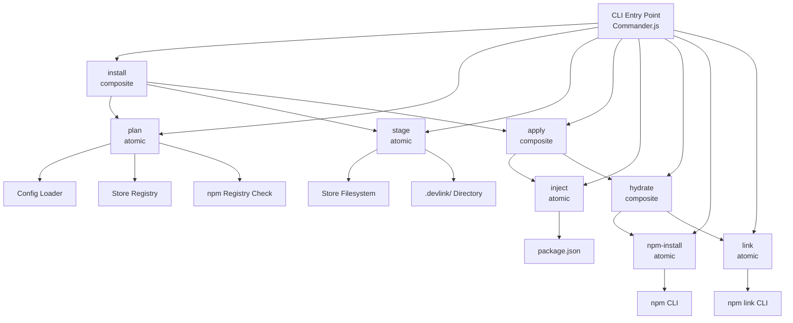
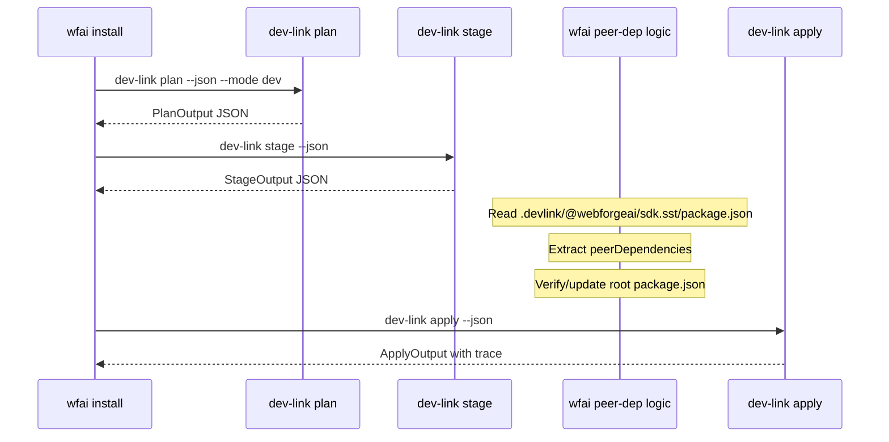

# Design Document: Install Pipeline Refactor

## Overview

This refactoring decomposes DevLink's monolithic `install` command (~900 lines) into a composable pipeline of independent, atomic commands that can be executed individually or chained together. Each atomic command produces structured JSON output, enabling external tools (like `wfai install`) to intercept the pipeline at any point and inject custom logic between steps.

The pipeline follows a strict composition hierarchy: `install = plan → stage → apply`, where `apply = inject → hydrate` and `hydrate = npm-install → link`. Composite commands orchestrate their sub-commands and collect a recursive `trace` of all sub-command outputs. Each atomic command is self-contained — it reads its inputs from the filesystem or stdin, performs a single responsibility, and writes structured output.

The config format evolves to support a `modes` object with a reserved `default` key, replacing the current top-level mode factory pattern. This enables `dev-link install` to run without an explicit `--mode` flag by resolving the default mode from config.

## Architecture



## Sequence Diagrams

### Full Install Pipeline

```mermaid
sequenceDiagram
    participant User
    participant CLI
    participant Plan as plan
    participant Stage as stage
    participant Apply as apply
    participant Inject as inject
    participant Hydrate as hydrate
    participant NpmInstall as npm-install
    participant Link as link

    User->>CLI: dev-link install [--mode dev] [--json]
    CLI->>Plan: execute(options)
    Plan->>Plan: loadConfig + resolveMode
    Plan->>Plan: resolvePackages(store/registry)
    Plan-->>CLI: PlanOutput JSON

    CLI->>Stage: execute(planOutput)
    Stage->>Stage: copyFromStore → .devlink/
    Stage->>Stage: relinkInternalDeps
    Stage-->>CLI: StageOutput JSON

    CLI->>Apply: execute(stageOutput)
    Apply->>Inject: execute(stageOutput)
    Inject->>Inject: rewrite package.json
    Inject-->>Apply: InjectOutput JSON

    Apply->>Hydrate: execute()
    Hydrate->>NpmInstall: execute()
    NpmInstall->>NpmInstall: spawn npm install
    NpmInstall-->>Hydrate: NpmInstallOutput JSON

    Hydrate->>Link: execute(planOutput.packages.link)
    Link->>Link: spawn npm link for each
    Link-->>Hydrate: LinkOutput JSON
    Hydrate-->>Apply: HydrateOutput JSON
    Apply-->>CLI: ApplyOutput JSON

    CLI-->>User: CompositeOutput with trace
```

### External Tool Interception (wfai install)



## Components and Interfaces

### Component 1: PlanCommand

**Purpose**: Resolves configuration and package registry to produce an installation plan. Pure computation — no filesystem mutations beyond reading config.

```typescript
interface PlanOptions {
  config?: string;
  configName?: string;
  configKey?: string;
  mode?: string;
  namespaces?: string[];
  packages?: string[];
  json?: boolean;
}

interface PlanOutput {
  version: "1";
  mode: string;
  manager: "store" | "npm";
  namespaces: string[];
  projectPath: string;
  packages: {
    store: PlanPackageEntry[];
    registry: PlanPackageEntry[];
    link: PlanLinkEntry[];
    remove: string[];
    skipped: PlanSkippedEntry[];
  };
}

interface PlanPackageEntry {
  name: string;
  version: string;
  namespace: string;
  path: string;
}

interface PlanLinkEntry {
  name: string;
  version: string;
  path: string;
  dev: boolean;
}

interface PlanSkippedEntry {
  name: string;
  version: string;
  reason: string;
}
```

**Responsibilities**:
- Load and normalize config (with `modes.default` resolution)
- Resolve mode factory to determine manager and namespaces
- For each package: resolve against store registry or npm registry
- Classify packages into store/registry/link/remove/skipped buckets
- Produce deterministic JSON output

### Component 2: StageCommand

**Purpose**: Copies packages from the store to `.devlink/` staging directory and rewrites internal dependencies between staged packages to use `file:` protocols.

```typescript
interface StageOptions {
  plan?: string;       // Path to plan JSON file, or reads from stdin
  projectPath?: string;
  json?: boolean;
}

interface StageOutput {
  projectPath: string;
  stagingDir: string;
  staged: StagedEntry[];
  relinked: RelinkEntry[];
}

interface StagedEntry {
  name: string;
  version: string;
  path: string;  // Relative path within .devlink/
}

interface RelinkEntry {
  package: string;
  dep: string;
  from: string;
  to: string;
}
```

**Responsibilities**:
- Read plan output (from file, stdin, or re-execute plan)
- Clean and recreate `.devlink/` staging directory
- Copy each `store` package from its store path to `.devlink/{name}/`
- Stage synthetic packages from npm (via `npm pack` + extract)
- Rewrite internal dependencies between staged packages to `file:` relative paths
- Produce structured output listing staged packages and relinked deps

### Component 3: InjectCommand

**Purpose**: Rewrites the project's `package.json` with `file:` protocols for staged packages and version specs for registry packages.

```typescript
interface InjectOptions {
  stage?: string;      // Path to stage JSON file, or reads from stdin
  plan?: string;       // Path to plan JSON (for registry/remove info)
  projectPath?: string;
  json?: boolean;
}

interface InjectOutput {
  projectPath: string;
  modified: string;
  injected: InjectedEntry[];
  registry: RegistryEntry[];
  removed: string[];
  synthetic: string[];
}

interface InjectedEntry {
  name: string;
  target: "dependencies" | "devDependencies";
  value: string;  // e.g., "file:.devlink/@webforgeai/sdk.core"
}

interface RegistryEntry {
  name: string;
  target: "dependencies" | "devDependencies";
  value: string;  // e.g., "1.0.0"
}
```

**Responsibilities**:
- Read stage output to know which packages are staged and where
- Read plan output to know registry packages and removals
- Rewrite `package.json`: add `file:` entries for staged, version entries for registry
- Remove packages marked for removal
- Skip synthetic packages (they exist in `.devlink/` but aren't injected into `package.json`)
- Respect `dev` flag for `devDependencies` vs `dependencies` placement

### Component 4: NpmInstallCommand

**Purpose**: Executes `npm install` in the project directory.

```typescript
interface NpmInstallOptions {
  projectPath?: string;
  ignoreScripts?: boolean;
  json?: boolean;
}

interface NpmInstallOutput {
  projectPath: string;
  exitCode: number;
  args: string[];
}
```

**Responsibilities**:
- Spawn `npm install --no-audit --legacy-peer-deps` in the project directory
- Optionally pass `--ignore-scripts`
- Route npm stdout/stderr to stderr when `--json` is active
- Report exit code in structured output

### Component 5: LinkCommand

**Purpose**: Executes `npm link` for packages with the `link` attribute.

```typescript
interface LinkOptions {
  plan?: string;       // Path to plan JSON (for link entries)
  projectPath?: string;
  json?: boolean;
}

interface LinkOutput {
  projectPath: string;
  linked: LinkedEntry[];
  failed: FailedLinkEntry[];
}

interface LinkedEntry {
  name: string;
  path: string;
}

interface FailedLinkEntry {
  name: string;
  path: string;
  exitCode: number;
}
```

**Responsibilities**:
- Read plan output to get link package entries
- For each link package: spawn `npm link <resolved-path>`
- Collect successes and failures
- Report structured output

### Component 6: HydrateCommand (Composite)

**Purpose**: Orchestrates `npm-install` → `link` sequence.

```typescript
interface HydrateOptions {
  plan?: string;
  projectPath?: string;
  ignoreScripts?: boolean;
  json?: boolean;
}

interface HydrateOutput {
  projectPath: string;
  success: boolean;
  trace: {
    "npm-install": NpmInstallOutput;
    link: LinkOutput;
  };
}
```

**Responsibilities**:
- Execute npm-install; if it fails, skip link and report failure
- Execute link
- Aggregate outputs into trace

### Component 7: ApplyCommand (Composite)

**Purpose**: Orchestrates `inject` → `hydrate` sequence.

```typescript
interface ApplyOptions {
  stage?: string;
  plan?: string;
  projectPath?: string;
  ignoreScripts?: boolean;
  json?: boolean;
}

interface ApplyOutput {
  projectPath: string;
  success: boolean;
  trace: {
    inject: InjectOutput;
    hydrate: HydrateOutput;
  };
}
```

**Responsibilities**:
- Execute inject
- Execute hydrate
- Aggregate outputs into trace

### Component 8: InstallCommand (Composite — Full Orchestrator)

**Purpose**: Orchestrates the complete `plan` → `stage` → `apply` pipeline.

```typescript
interface InstallOptions {
  config?: string;
  configName?: string;
  configKey?: string;
  mode?: string;
  namespaces?: string[];
  packages?: string[];
  ignoreScripts?: boolean;
  json?: boolean;
  recursive?: boolean;
}

interface InstallOutput {
  projectPath: string;
  success: boolean;
  trace: {
    plan: PlanOutput;
    stage: StageOutput;
    apply: ApplyOutput;
  };
}
```

**Responsibilities**:
- Execute plan → stage → apply in sequence
- Fail-fast: if any step fails, stop and report
- Aggregate all outputs into recursive trace
- Support `--recursive` mode for multi-level monorepos

## Data Models

### Config Structure (New Format)

```typescript
interface DevLinkConfigV2 {
  modes: {
    default: string;  // Reserved: alias to default mode name
    [modeName: string]: ModeFactory | string;
  };
  packages: Record<string, PackageSpecNew>;
}

// Example:
// {
//   modes: {
//     default: "dev",
//     dev: (ctx) => ({ manager: "store" }),
//     remote: (ctx) => ({ manager: "npm", namespaces: ["global", "team"] }),
//   },
//   packages: { ... }
// }
```

**Validation Rules**:
- `modes.default` must be a string referencing an existing mode key
- Each non-`default` entry in `modes` must be a function (ModeFactory)
- `packages` must be a non-empty object
- Each package spec must have a `version` field (string or Record)

### Pipeline State Flow

```typescript
/**
 * Represents the state passed between pipeline stages.
 * Each stage reads the output of the previous stage.
 */
type PipelineState =
  | { stage: "planned"; data: PlanOutput }
  | { stage: "staged"; data: StageOutput; plan: PlanOutput }
  | { stage: "injected"; data: InjectOutput }
  | { stage: "hydrated"; data: HydrateOutput }
  | { stage: "complete"; data: InstallOutput };
```

### Output Routing

```typescript
/**
 * Controls where output goes based on --json flag.
 */
interface OutputRouter {
  /** Structured data output (stdout when --json, suppressed otherwise) */
  json(data: unknown): void;
  /** Human-friendly output (stdout when no --json, suppressed when --json) */
  human(message: string): void;
  /** Auxiliary/progress output (always stderr) */
  log(message: string): void;
  /** Subprocess stdio configuration */
  subprocessStdio(): "inherit" | "pipe";
}
```

## Algorithmic Pseudocode

### Plan Resolution Algorithm

```typescript
/**
 * ALGORITHM: resolveInstallationPlan
 *
 * Resolves all packages in config against store and npm registries,
 * classifying each into the appropriate bucket.
 *
 * Preconditions:
 *   - config is loaded and normalized
 *   - mode is resolved (from --mode flag or modes.default)
 *   - registry is readable (store registry loaded)
 *
 * Postconditions:
 *   - Every package in config is classified into exactly one bucket
 *   - store[] contains packages found in the DevLink store
 *   - registry[] contains packages found in npm
 *   - link[] contains packages with link attribute
 *   - remove[] contains packages with no version for current mode
 *   - skipped[] contains packages that couldn't be resolved anywhere
 *
 * Loop Invariant:
 *   - At each iteration, the package being processed is not yet in any bucket
 *   - After each iteration, the package is in exactly one bucket
 */
async function resolveInstallationPlan(
  config: NormalizedConfig,
  mode: string,
  modeConfig: ModeConfig,
  namespaces: string[],
  registry: Registry,
  packageFilter?: Set<string>
): Promise<PlanOutput["packages"]> {
  const result: PlanOutput["packages"] = {
    store: [], registry: [], link: [], remove: [], skipped: []
  };

  for (const [pkgName, spec] of Object.entries(config.packages)) {
    // Skip if not in filter (when filter is active)
    if (packageFilter && !packageFilter.has(pkgName)) continue;

    // Link packages bypass resolution entirely
    if (spec.link) {
      result.link.push({
        name: pkgName,
        version: resolveVersionForMode(spec, mode),
        path: spec.link,
        dev: spec.dev
      });
      continue;
    }

    // Resolve version for current mode
    const version = resolveVersionForMode(spec, mode);
    if (!version) {
      result.remove.push(pkgName);
      continue;
    }

    // Resolution strategy depends on manager
    if (modeConfig.manager === "store") {
      // Primary: store → Fallback: npm
      const storeResult = resolvePackage(pkgName, version, namespaces, registry);
      if (storeResult.found) {
        result.store.push({
          name: pkgName, version, namespace: storeResult.namespace!,
          path: storeResult.path!
        });
      } else {
        const npmExists = await checkNpmExists(pkgName, version);
        if (npmExists) {
          result.registry.push({ name: pkgName, version, namespace: "npm", path: "" });
        } else {
          result.skipped.push({ name: pkgName, version, reason: "not found in store or npm" });
        }
      }
    } else {
      // Primary: npm → Fallback: store
      const npmExists = await checkNpmExists(pkgName, version);
      if (npmExists) {
        result.registry.push({ name: pkgName, version, namespace: "npm", path: "" });
      } else {
        const storeResult = resolvePackage(pkgName, version, namespaces, registry);
        if (storeResult.found) {
          result.store.push({
            name: pkgName, version, namespace: storeResult.namespace!,
            path: storeResult.path!
          });
        } else {
          result.skipped.push({ name: pkgName, version, reason: "not found in npm or store" });
        }
      }
    }
  }

  return result;
}
```

### Stage and Relink Algorithm

```typescript
/**
 * ALGORITHM: stagePackages
 *
 * Copies resolved packages from store to .devlink/ and rewrites
 * internal dependencies to file: protocols.
 *
 * Preconditions:
 *   - planOutput.packages.store contains valid store paths
 *   - projectPath exists and is writable
 *
 * Postconditions:
 *   - .devlink/ contains a copy of each store package
 *   - Internal dependencies between staged packages use file: protocols
 *   - No external dependencies are modified
 *   - Original store packages are unmodified
 *
 * Loop Invariant (relink phase):
 *   - availableInStaging contains all packages staged so far
 *   - Each relinked dependency points to a valid staged path
 */
async function stagePackages(
  projectPath: string,
  storePackages: PlanPackageEntry[]
): Promise<StageOutput> {
  const stagingDir = path.join(projectPath, ".devlink");
  await fs.rm(stagingDir, { recursive: true, force: true });
  await fs.mkdir(stagingDir, { recursive: true });

  const staged: StagedEntry[] = [];
  const relinked: RelinkEntry[] = [];

  // Phase 1: Copy all packages to staging
  for (const pkg of storePackages) {
    const destPath = path.join(stagingDir, pkg.name);
    await copyDir(pkg.path, destPath);
    staged.push({ name: pkg.name, version: pkg.version, path: `.devlink/${pkg.name}` });
  }

  // Phase 2: Build index of available packages
  const availableIndex = new Map<string, { version: string; absPath: string }>();
  for (const entry of staged) {
    availableIndex.set(entry.name, {
      version: entry.version,
      absPath: path.join(projectPath, entry.path)
    });
  }

  // Phase 3: Rewrite internal dependencies
  for (const entry of staged) {
    const manifestPath = path.join(projectPath, entry.path, "package.json");
    const manifest = JSON.parse(await fs.readFile(manifestPath, "utf-8"));
    let modified = false;

    for (const depField of ["dependencies", "peerDependencies"] as const) {
      const deps = manifest[depField];
      if (!deps) continue;

      for (const [depName, depRange] of Object.entries(deps)) {
        const available = availableIndex.get(depName);
        if (!available) continue;
        if (!semver.satisfies(available.version, depRange as string)) continue;

        const relativePath = path.relative(
          path.join(projectPath, entry.path),
          available.absPath
        );
        const fileRef = `file:${relativePath}`;

        relinked.push({
          package: entry.name,
          dep: depName,
          from: depRange as string,
          to: fileRef
        });

        deps[depName] = fileRef;
        modified = true;
      }
    }

    if (modified) {
      await fs.writeFile(manifestPath, JSON.stringify(manifest, null, 2));
    }
  }

  return { projectPath, stagingDir: ".devlink", staged, relinked };
}
```

### Composite Command Execution Pattern

```typescript
/**
 * ALGORITHM: executeComposite
 *
 * Generic pattern for composite command execution with trace collection.
 *
 * Preconditions:
 *   - steps is a non-empty ordered array of sub-commands
 *   - Each step has a name and an execute function
 *
 * Postconditions:
 *   - If all steps succeed: success=true, trace contains all outputs
 *   - If any step fails: success=false, trace contains outputs up to failure
 *   - Trace is recursive (composites within composites nest their traces)
 *
 * Loop Invariant:
 *   - All previously executed steps succeeded
 *   - trace contains the output of all previously executed steps
 */
async function executeComposite<T extends Record<string, unknown>>(
  steps: Array<{ name: string; execute: () => Promise<{ success: boolean; output: unknown }> }>,
  baseOutput: Omit<T, "success" | "trace">
): Promise<{ success: boolean; output: T }> {
  const trace: Record<string, unknown> = {};

  for (const step of steps) {
    const result = await step.execute();
    trace[step.name] = result.output;

    if (!result.success) {
      return {
        success: false,
        output: { ...baseOutput, success: false, trace } as T
      };
    }
  }

  return {
    success: true,
    output: { ...baseOutput, success: true, trace } as T
  };
}
```

## Key Functions with Formal Specifications

### Function: resolveMode()

```typescript
function resolveMode(config: DevLinkConfigV2, explicitMode?: string): string
```

**Preconditions:**
- `config.modes` is defined and is an object
- `config.modes.default` is a string referencing a valid mode key
- If `explicitMode` is provided, it must exist as a key in `config.modes`

**Postconditions:**
- Returns a string that is a valid key in `config.modes`
- If `explicitMode` is provided, returns `explicitMode`
- If `explicitMode` is undefined, returns `config.modes.default`
- Throws if the resolved mode name doesn't have a corresponding factory

**Loop Invariants:** N/A

### Function: routeOutput()

```typescript
function routeOutput(jsonMode: boolean): OutputRouter
```

**Preconditions:**
- `jsonMode` is a boolean

**Postconditions:**
- Returns an OutputRouter that correctly routes output based on mode
- When `jsonMode=true`: `json()` writes to stdout, `human()` is no-op, subprocess stdio is "pipe"
- When `jsonMode=false`: `json()` is no-op, `human()` writes to stdout, subprocess stdio is "inherit"
- `log()` always writes to stderr regardless of mode

**Loop Invariants:** N/A

### Function: readPipelineInput()

```typescript
async function readPipelineInput<T>(filePath?: string): Promise<T>
```

**Preconditions:**
- If `filePath` is provided, the file exists and contains valid JSON
- If `filePath` is undefined, stdin contains valid JSON (piped from previous command)

**Postconditions:**
- Returns parsed JSON of type T
- Throws with descriptive error if file doesn't exist or JSON is invalid
- Does not modify the input source

**Loop Invariants:** N/A

## Example Usage

### Individual Command Execution

```typescript
// Execute plan independently, pipe to file
// $ dev-link plan --mode dev --json > plan.json

// Execute stage with plan input
// $ dev-link stage --json < plan.json > stage.json

// External tool intercepts here...
// $ wfai peer-dep-check --stage stage.json

// Execute apply (inject + hydrate)
// $ dev-link apply --json --plan plan.json < stage.json
```

### Programmatic Usage (Library API)

```typescript
import { plan, stage, apply } from "devlink/pipeline";

// Full pipeline
const planOutput = await plan({ mode: "dev" });
const stageOutput = await stage({ plan: planOutput });

// External logic between stage and apply
const sstManifest = await readStagedManifest(stageOutput, "@webforgeai/sdk.sst");
await reconcilePeerDeps(sstManifest.peerDependencies);

// Continue pipeline
const applyOutput = await apply({ stage: stageOutput, plan: planOutput });
```

### CLI Composition via Shell

```bash
# Full install (equivalent to dev-link install --json)
dev-link plan --mode dev --json | dev-link stage --json | dev-link apply --json

# Partial: just plan and stage
dev-link plan --mode dev --json | dev-link stage --json

# Use plan file for multiple downstream commands
dev-link plan --mode dev --json > /tmp/plan.json
dev-link stage --json --plan /tmp/plan.json
dev-link apply --json --plan /tmp/plan.json
```

## Correctness Properties

*A property is a characteristic or behavior that should hold true across all valid executions of a system — essentially, a formal statement about what the system should do. Properties serve as the bridge between human-readable specifications and machine-verifiable correctness guarantees.*

### Property 1: Mode Resolution Determinism

*For any* valid config with a `modes` object and optional explicit `--mode` flag, `resolveMode` SHALL always return the explicit mode when provided, and `modes.default` otherwise. Given the same inputs, the result is always the same.

**Validates: Requirements 1.1, 1.3**

### Property 2: Config Validation Rejects Invalid Modes

*For any* config where `modes.default` references a non-existent mode key, or where a non-`default` entry in `modes` is not a callable function, THE Config_Loader SHALL reject the config with a descriptive error.

**Validates: Requirements 1.2, 1.4**

### Property 3: Bucket Exclusivity

*For any* valid config, mode, and registry state, the Plan_Command SHALL classify every configured package into exactly one bucket (store, registry, link, remove, or skipped), with no package appearing in multiple buckets and no package left unclassified.

**Validates: Requirements 2.1, 2.5, 2.6**

### Property 4: Resolution Priority by Manager

*For any* package and manager setting, when `manager: "store"` the Plan_Command SHALL check the store first and fall back to npm, and when `manager: "npm"` it SHALL check npm first and fall back to the store. A package available in both registries always lands in the primary registry's bucket.

**Validates: Requirements 2.2, 2.3**

### Property 5: Link Packages Bypass Resolution

*For any* package with a `link` attribute in the config, regardless of manager setting or registry availability, the Plan_Command SHALL always classify it in the `link` bucket.

**Validates: Requirement 2.4**

### Property 6: Package Filter Restricts Output

*For any* config and any subset of package names provided as a filter, the Plan_Command SHALL only include packages matching the filter in its output, with no unfiltered packages appearing in any bucket.

**Validates: Requirement 2.7**

### Property 7: Plan and Store Immutability

*For any* plan or stage execution, the original store packages and config files SHALL remain unmodified. Plan performs no filesystem writes; stage copies but never mutates source paths.

**Validates: Requirements 2.8, 3.6**

### Property 8: Staging Produces Clean State

*For any* valid plan output, after staging, the `.devlink/` directory SHALL contain exactly the packages listed in the plan's store bucket — no more, no less — regardless of any pre-existing `.devlink/` contents.

**Validates: Requirements 3.1, 3.2**

### Property 9: Relink Correctness

*For any* set of staged packages with internal dependencies, the Stage_Command SHALL rewrite a dependency to a `file:` path if and only if the staged version satisfies the dependency's semver range. Every `file:` reference SHALL point to a valid directory within `.devlink/` containing the referenced package.

**Validates: Requirements 3.3, 3.4**

### Property 10: Inject Classification Correctness

*For any* package classification (store/staged → `file:` entry, registry → version string, remove → deletion, synthetic → skipped, dev → devDependencies), the Inject_Command SHALL place the package in the correct location in `package.json` according to its classification and flags.

**Validates: Requirements 4.1, 4.2, 4.3, 4.4, 4.5**

### Property 11: Subprocess Exit Code Reporting

*For any* npm exit code (zero or non-zero), the NpmInstall_Command SHALL include the exit code in its structured output and SHALL NOT throw an unhandled exception.

**Validates: Requirements 5.4, 5.5**

### Property 12: Link Command Resilience

*For any* set of link packages where some npm link invocations succeed and some fail, the Link_Command SHALL process all entries, recording successes in `linked[]` and failures in `failed[]` with their exit codes.

**Validates: Requirements 6.1, 6.2, 6.3**

### Property 13: Composite Fail-Fast Propagation

*For any* composite command (hydrate, apply, install), if a sub-command reports failure, all subsequent sub-commands SHALL be skipped and the composite SHALL report `success: false`.

**Validates: Requirements 7.2, 8.2, 9.2**

### Property 14: Trace Completeness and Structure

*For any* composite command execution, the output SHALL contain a `trace` field with keys matching sub-command names, containing the output of every executed sub-command (including the failed one if applicable). Nested composites SHALL include their own recursive traces.

**Validates: Requirements 11.1, 11.2, 11.3, 11.4**

### Property 15: Output Isolation

*For any* command execution with `--json` active, stdout SHALL contain only valid parseable JSON. All progress messages, subprocess output, and log messages SHALL be routed to stderr. Without `--json`, log messages still go to stderr.

**Validates: Requirements 10.1, 10.3, 10.5**

### Property 16: Composition Equivalence

*For any* valid config and store state, executing `dev-link install --json` SHALL produce the same final filesystem state (`.devlink/` contents, `package.json` modifications, `node_modules/` state) as executing `plan → stage → apply` as individual commands piped together.

**Validates: Requirement 12.5**

### Property 17: Pipeline Output Composability

*For any* pipeline command's JSON output, the next command in the pipeline SHALL be able to parse and consume it as valid input without errors. Specifically: plan output is valid stage input, and stage output is valid apply input.

**Validates: Requirement 12.2**

### Property 18: Legacy Config Backward Compatibility

*For any* config using the existing top-level mode factory pattern (without a `modes` object), the Config_Loader SHALL load it successfully and resolve modes as before the refactor.

**Validates: Requirement 13.2**

### Property 19: Recursive Execution Order

*For any* monorepo tree with multiple install levels, the Install_Command with `--recursive` SHALL execute the pipeline at each level in hierarchical order: root → sub-monorepos → isolated packages.

**Validates: Requirement 14.2**

### Property 20: Recursive Resilience

*For any* multi-level recursive install where one or more levels fail, the Install_Command SHALL continue executing remaining levels, report per-level results with paths, and produce structured output containing all level outcomes.

**Validates: Requirements 14.3, 14.4**

## Error Handling

### Error Scenario 1: Config Not Found

**Condition**: No config file found at expected paths and no `--config` flag provided
**Response**: Plan command throws with descriptive error listing searched paths
**Recovery**: User provides `--config` flag or creates config file

### Error Scenario 2: Mode Not Defined

**Condition**: Resolved mode name doesn't have a corresponding factory in config
**Response**: Plan command throws with error naming the invalid mode and listing available modes
**Recovery**: User provides valid `--mode` flag or fixes `modes.default`

### Error Scenario 3: Store Package Not Found

**Condition**: Package version not found in store registry (and npm fallback also fails)
**Response**: Package is placed in `skipped` bucket with reason. Plan succeeds (non-fatal).
**Recovery**: User publishes the package to store or updates version in config

### Error Scenario 4: npm install Failure

**Condition**: `npm install` exits with non-zero code
**Response**: npm-install command reports `exitCode` in output. Hydrate reports `success: false`. Link step is skipped.
**Recovery**: User fixes dependency conflicts and re-runs `dev-link hydrate` or `dev-link install`

### Error Scenario 5: Staging Directory Not Writable

**Condition**: Cannot create or write to `.devlink/` directory
**Response**: Stage command throws with filesystem error
**Recovery**: User fixes permissions or disk space

### Error Scenario 6: Invalid Pipeline Input

**Condition**: Stdin or file input is not valid JSON or doesn't match expected schema
**Response**: Command throws with parse error indicating expected format
**Recovery**: User re-runs upstream command to regenerate valid output

## Testing Strategy

### Unit Testing Approach

Each atomic command is tested in isolation with mocked filesystem and subprocess calls:

- **Plan**: Mock registry reads and npm existence checks. Verify bucket classification logic.
- **Stage**: Use temp directories with fixture packages. Verify copy and relink correctness.
- **Inject**: Use fixture `package.json` files. Verify correct `file:` and version injection.
- **Link**: Mock `npm link` subprocess. Verify path resolution and error handling.
- **Output routing**: Verify stdout/stderr separation based on `--json` flag.

### Property-Based Testing Approach

**Property Test Library**: fast-check

Key properties to test:
- **Bucket exclusivity**: For any valid config, every package lands in exactly one bucket
- **Relink symmetry**: If A depends on B and both are staged, A's dep on B becomes `file:` pointing to B's staging path
- **Idempotency**: `stage(plan(config))` produces same output regardless of execution count
- **Trace structure**: Composite output always contains trace keys matching sub-command names

### Integration Testing Approach

End-to-end tests using fixture monorepo projects:
- Full `install` pipeline produces correct `node_modules/` state
- Individual commands compose correctly via file-based piping
- `--json` output is valid JSON parseable by downstream tools
- Human output matches expected format without JSON artifacts

## Performance Considerations

- **Parallel npm checks**: In plan phase, `checkNpmExists` calls can be parallelized with `Promise.all` (batched to avoid rate limiting)
- **Incremental staging**: Future optimization — skip copying packages whose store signature matches the already-staged version (compare checksums)
- **Stream processing**: For large monorepos, plan output could be streamed rather than buffered, but initial implementation uses buffered JSON for simplicity

## Security Considerations

- **No secrets in output**: Plan output includes store paths but never credentials or tokens
- **Subprocess isolation**: npm commands run with `shell: true` but only with controlled arguments (no user-provided strings interpolated into commands)
- **File protocol safety**: `file:` references are always relative paths within the project, never absolute paths that could escape the project boundary

## Dependencies

| Dependency | Purpose | Existing? |
|-----------|---------|-----------|
| Commander.js | CLI argument parsing | Yes |
| semver | Version range satisfaction for relink | Yes |
| fs/promises | Filesystem operations | Yes (Node built-in) |
| child_process | Subprocess spawning (npm) | Yes (Node built-in) |
| fast-check | Property-based testing | New (dev dependency) |
