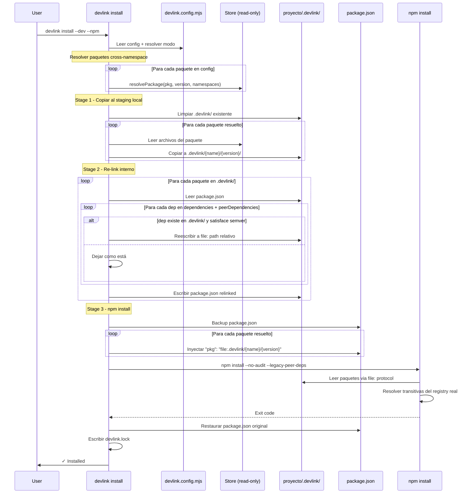

# Documento de Diseño: Store File Linking

## Overview

DevLink actualmente tiene tres managers de instalación: `store`, `npm` y `proxy`. El manager `proxy` resultó demasiado complejo (servidor HTTP custom, fetchPackument, generación de tarballs, dos fases de npm install). Esta feature reemplaza el proxy con una solución más simple: mejorar el manager `store` para que soporte instalación vía `npm install` usando el protocolo `file:` nativo de npm.

### Problema con el diseño anterior

El diseño anterior proponía hacer re-link dentro del store por namespace. Pero DevLink es multi-namespace: los paquetes se resuelven con precedencia cross-namespace (ej: `["feature-v2", "global"]`). Un paquete en `feature-v2` puede depender de otro en `global`. El re-link por namespace aislado nunca conectaría paquetes entre namespaces distintos.

### Nuevo enfoque: Staging local en el proyecto

El re-link NO ocurre en el store. En su lugar:

1. `devlink install --dev --npm` resuelve los paquetes según la precedencia de namespaces configurada (cross-namespace)
2. Los copia a una carpeta `.devlink/` dentro del proyecto
3. En esa carpeta local, ya con todos los paquetes resueltos de múltiples namespaces, hace el re-link con `file:` paths relativos
4. Inyecta los `file:` paths (apuntando a `.devlink/`) en el `package.json` del proyecto y corre `npm install`
5. Restaura el `package.json` original

Ventajas:
- Cross-namespace funciona naturalmente (los paquetes ya están resueltos)
- El store nunca se modifica (fuente de verdad pura)
- Cada proyecto tiene su propia resolución sin interferir con otros
- `.devlink/` es regenerable y se agrega a `.gitignore`

## Arquitectura

```mermaid
graph TD
    subgraph "Install Flow (store + --npm)"
        A[devlink install --dev --npm] --> B[Resolver paquetes cross-namespace]
        B --> C["Copiar a proyecto/.devlink/"]
        C --> D["Re-link: reescribir deps a file: relativos"]
        D --> E[Backup package.json del proyecto]
        E --> F["Inyectar file: paths a .devlink/"]
        F --> G[npm install]
        G --> H[Restaurar package.json]
        H --> I[Actualizar devlink.lock]
    end

    subgraph "Store (sin modificar)"
        S1[namespace/global/@scope/pkg/1.0.0/]
        S2[namespace/feature-v2/@scope/pkg/1.0.0/]
    end

    subgraph "Proyecto/.devlink/ (staging local)"
        P1["@scope/core/0.1.0/package.json (relinked)"]
        P2["@scope/http/0.1.0/package.json (relinked)"]
    end

    B -->|"lee"| S1
    B -->|"lee"| S2
    C -->|"copia"| P1
    C -->|"copia"| P2
    G -.->|"npm lee file: paths"| P1
    G -.->|"npm lee file: paths"| P2
```

## Diagrama de Secuencia: Install con --npm



## Componentes e Interfaces

### Componente 1: Staging (nuevo)

**Propósito**: Copiar paquetes resueltos del store a `.devlink/` en el proyecto y hacer re-link de dependencias internas.

```typescript
/** Directorio de staging dentro del proyecto */
const STAGING_DIR = ".devlink";

interface StagingResult {
  /** Paquetes copiados al staging */
  staged: StagedPackage[];
  /** Dependencias reescritas a file: */
  relinked: RelinkDetail[];
}

interface StagedPackage {
  name: string;
  version: string;
  namespace: string;
  /** Path absoluto en .devlink/ */
  stagingPath: string;
}

interface RelinkDetail {
  /** Paquete que fue modificado */
  package: string;
  /** Dependencia reescrita */
  dep: string;
  /** Valor original (ej: "^0.1.0") */
  from: string;
  /** Valor reescrito (ej: "file:../../@webforgeai/core/0.1.0") */
  to: string;
}

/**
 * Copia paquetes resueltos al staging local y reescribe dependencias internas.
 *
 * 1. Limpia .devlink/ si existe
 * 2. Copia cada paquete resuelto del store a .devlink/{name}/{version}/
 * 3. Construye índice de paquetes disponibles en staging
 * 4. Para cada paquete, reescribe deps internas a file: paths relativos
 */
async function stageAndRelink(
  projectPath: string,
  resolvedPackages: ResolvedPackage[]
): Promise<StagingResult>
```

**Responsabilidades**:
- Limpiar y recrear `.devlink/` en el proyecto
- Copiar paquetes del store al staging (preservando estructura)
- Construir índice de paquetes disponibles para re-link
- Reescribir `dependencies` y `peerDependencies` internas a `file:` paths relativos
- Usar `semver.maxSatisfying()` para resolver rangos de versiones
- No modificar `devDependencies`
- No modificar dependencias externas (no presentes en staging)

### Componente 2: Package.json Injection (modificado)

**Propósito**: Inyectar paquetes del staging como `file:` dependencies en el `package.json` del proyecto.

```typescript
interface PackageJsonBackup {
  packageJsonPath: string;
  originalContent: string;
  restored: boolean;
}

/**
 * Inyecta paquetes del staging como file: dependencies.
 * Usa paths relativos desde el proyecto a .devlink/.
 */
async function injectStagedPackages(
  projectPath: string,
  stagedPackages: StagedPackage[]
): Promise<PackageJsonBackup>

/**
 * Restaura el package.json original desde el backup.
 */
async function restorePackageJson(
  backup: PackageJsonBackup
): Promise<void>
```

**Responsabilidades**:
- Hacer backup del `package.json` del proyecto
- Inyectar paquetes como `"file:.devlink/{name}/{version}"` (paths relativos)
- Restaurar el `package.json` original después del install (siempre, incluso en error)

### Componente 3: Eliminación del Proxy

**Propósito**: Remover completamente el manager `proxy` y todo su código asociado.

**Archivos a eliminar**:
- `src/proxy/server.ts`
- `src/proxy/npm-delegate.ts`
- `src/proxy/tarball.ts`
- `src/proxy/lifecycle.ts`
- `src/proxy/project-lock.ts`
- `src/proxy/npmrc.ts`
- `src/__tests__/proxy.spec.ts`

**Cambios en tipos**:
```typescript
// Antes
interface ModeConfig {
  manager: "store" | "npm" | "proxy";
  peerOptional?: string[];
  // ...
}

// Después
interface ModeConfig {
  manager: "store" | "npm";
  // peerOptional eliminado — file: protocol resuelve transitivas
  // ...
}
```

## Modelos de Datos

### Estructura del staging (.devlink/)

```
proyecto/
├── .devlink/                          ← staging local (regenerable)
│   ├── @webforgeai/
│   │   ├── core/
│   │   │   └── 0.1.0/
│   │   │       ├── package.json       ← relinked (deps internas → file:)
│   │   │       ├── dist/
│   │   │       └── ...
│   │   └── http/
│   │       └── 0.1.0/
│   │           ├── package.json       ← relinked
│   │           ├── dist/
│   │           └── ...
│   └── @webforgeai/
│       └── sst/
│           └── 0.1.0/
│               ├── package.json       ← relinked
│               └── ...
├── package.json                       ← nunca se modifica permanentemente
├── devlink.lock
└── node_modules/
```

### package.json en staging (relinked)

Ejemplo: `@webforgeai/http` depende de `@webforgeai/core`. Ambos resueltos (posiblemente de namespaces distintos) y copiados a `.devlink/`.

```json
// .devlink/@webforgeai/http/0.1.0/package.json (después del re-link)
{
  "name": "@webforgeai/http",
  "version": "0.1.0",
  "dependencies": {
    "@webforgeai/core": "file:../../@webforgeai/core/0.1.0",
    "express": "^4.18.0"
  }
}
```

**Reglas de reescritura**:
- El path `file:` es relativo desde el directorio del paquete actual al directorio del paquete dependencia dentro de `.devlink/`
- Solo se reescriben `dependencies` y `peerDependencies` (no `devDependencies`)
- Solo se reescribe si la versión en staging satisface el semver range original
- Si hay múltiples versiones que satisfacen, se usa `semver.maxSatisfying()`
- Dependencias externas (no en staging) quedan sin modificar

### Inyección temporal en package.json del proyecto

```json
// package.json del proyecto (temporal, durante npm install)
{
  "name": "my-app",
  "dependencies": {
    "express": "^4.18.0",
    "@webforgeai/core": "file:.devlink/@webforgeai/core/0.1.0",
    "@webforgeai/http": "file:.devlink/@webforgeai/http/0.1.0"
  }
}
```

Nota: los paths son relativos al proyecto (no absolutos), lo cual es más limpio y portable.

### Store (sin cambios)

El store queda exactamente como está. No se agrega `package.json.original` ni se modifica ningún archivo. El store es read-only durante el install.

```
~/.devlink/namespaces/{namespace}/{@scope/}{name}/{version}/
├── package.json     ← original, sin modificar
├── devlink.sig
├── dist/
└── ...
```

## Pseudocódigo Algorítmico

### Algoritmo: Stage + Re-link + Install

```typescript
async function installWithFileProtocol(
  projectPath: string,
  config: DevLinkConfig,
  mode: "dev" | "prod",
  modeConfig: ModeConfig,
  options: InstallOptions
): Promise<InstallResult> {
  const namespaces = options.namespaces || modeConfig.namespaces || [DEFAULT_NAMESPACE];
  const registry = await readRegistry();
  const result: InstallResult = { installed: [], skipped: [] };
  const stagingDir = path.join(projectPath, STAGING_DIR);

  // ================================================================
  // FASE 1: Resolver paquetes cross-namespace
  // ================================================================
  const resolvedPackages: ResolvedPackage[] = [];
  for (const [pkgName, versions] of Object.entries(config.packages)) {
    const version = mode === "dev" ? versions.dev : versions.prod;
    if (!version) continue;

    const resolution = resolvePackage(pkgName, version, namespaces, registry);
    if (resolution.found) {
      resolvedPackages.push({
        name: pkgName,
        version,
        qname: `${pkgName}@${version}`,
        namespace: resolution.namespace,
        path: resolution.path,
        signature: resolution.signature,
      });
    } else {
      result.skipped.push({ name: pkgName, version, reason: "Not found" });
    }
  }

  if (resolvedPackages.length === 0) {
    return result;
  }

  // ================================================================
  // FASE 2: Stage + Re-link
  // ================================================================
  const staging = await stageAndRelink(projectPath, resolvedPackages);

  // ================================================================
  // FASE 3: Inyectar file: deps + npm install
  // ================================================================
  const backup = await injectStagedPackages(projectPath, staging.staged);

  try {
    result.npmExitCode = await runNpmInstall(options.runScripts);

    if (result.npmExitCode !== 0) {
      return result;
    }

    // ================================================================
    // FASE 4: Tracking
    // ================================================================
    const lockfile = await readLockfile(projectPath);
    const installedPackages: Record<string, InstalledPackage> = {};

    for (const pkg of resolvedPackages) {
      lockfile.packages[pkg.name] = {
        version: pkg.version,
        signature: pkg.signature!,
        namespace: pkg.namespace,
      };
      installedPackages[pkg.name] = {
        version: pkg.version,
        namespace: pkg.namespace!,
        signature: pkg.signature!,
        installedAt: new Date().toISOString(),
      };
      result.installed.push(pkg);
    }

    await writeLockfile(projectPath, lockfile);

    if (Object.keys(installedPackages).length > 0) {
      await withStoreLock(async () => {
        const installations = await readInstallations();
        registerProject(installations, projectPath, installedPackages);
        await writeInstallations(installations);
      });
    }

    return result;
  } finally {
    // SIEMPRE restaurar package.json
    await restorePackageJson(backup);
  }
}
```

### Algoritmo: stageAndRelink()

```typescript
async function stageAndRelink(
  projectPath: string,
  resolvedPackages: ResolvedPackage[]
): Promise<StagingResult> {
  const stagingDir = path.join(projectPath, STAGING_DIR);
  const result: StagingResult = { staged: [], relinked: [] };

  // 1. Limpiar staging existente
  await fs.rm(stagingDir, { recursive: true, force: true });
  await fs.mkdir(stagingDir, { recursive: true });

  // 2. Copiar paquetes del store al staging
  for (const pkg of resolvedPackages) {
    const destPath = path.join(stagingDir, pkg.name, pkg.version);
    await copyDir(pkg.path!, destPath);
    result.staged.push({
      name: pkg.name,
      version: pkg.version,
      namespace: pkg.namespace!,
      stagingPath: destPath,
    });
  }

  // 3. Construir índice: packageName → [{ version, path }]
  const availableInStaging = new Map<string, { version: string; path: string }[]>();
  for (const staged of result.staged) {
    const entries = availableInStaging.get(staged.name) || [];
    entries.push({ version: staged.version, path: staged.stagingPath });
    availableInStaging.set(staged.name, entries);
  }

  // 4. Re-link: reescribir deps internas a file: paths relativos
  for (const staged of result.staged) {
    const manifestPath = path.join(staged.stagingPath, "package.json");
    let manifest: PackageManifest;
    try {
      manifest = JSON.parse(await fs.readFile(manifestPath, "utf-8"));
    } catch {
      continue; // Skip si no tiene package.json válido
    }

    let modified = false;

    for (const depField of ["dependencies", "peerDependencies"] as const) {
      const deps = manifest[depField];
      if (!deps) continue;

      for (const [depName, depRange] of Object.entries(deps)) {
        const stagingEntries = availableInStaging.get(depName);
        if (!stagingEntries) continue;

        // Encontrar la mejor versión que satisface el range
        const versions = stagingEntries.map(e => e.version);
        const bestVersion = semver.maxSatisfying(versions, depRange);
        if (!bestVersion) continue;

        // Encontrar el path del paquete con esa versión
        const bestEntry = stagingEntries.find(e => e.version === bestVersion)!;
        const relativePath = path.relative(staged.stagingPath, bestEntry.path);
        const fileRef = `file:${relativePath}`;

        result.relinked.push({
          package: `${staged.name}@${staged.version}`,
          dep: depName,
          from: depRange,
          to: fileRef,
        });

        deps[depName] = fileRef;
        modified = true;
      }
    }

    if (modified) {
      await fs.writeFile(manifestPath, JSON.stringify(manifest, null, 2));
    }
  }

  return result;
}
```

### Algoritmo: injectStagedPackages()

```typescript
async function injectStagedPackages(
  projectPath: string,
  stagedPackages: StagedPackage[]
): Promise<PackageJsonBackup> {
  const packageJsonPath = path.join(projectPath, "package.json");
  const originalContent = await fs.readFile(packageJsonPath, "utf-8");
  const backup: PackageJsonBackup = { packageJsonPath, originalContent, restored: false };

  const manifest = JSON.parse(originalContent);
  manifest.dependencies = manifest.dependencies || {};

  for (const pkg of stagedPackages) {
    // Path relativo desde el proyecto a .devlink/{name}/{version}
    const relativePath = path.relative(projectPath, pkg.stagingPath);
    manifest.dependencies[pkg.name] = `file:${relativePath}`;
  }

  await fs.writeFile(packageJsonPath, JSON.stringify(manifest, null, 2) + "\n");
  return backup;
}
```

**Precondiciones:**
- `projectPath/package.json` existe y es JSON válido
- Cada `StagedPackage` tiene `stagingPath` definido dentro de `.devlink/`

**Postcondiciones:**
- `backup.originalContent` contiene el contenido exacto del `package.json` antes de la modificación
- `package.json` del proyecto contiene cada paquete como `"file:.devlink/{name}/{version}"`
- Las dependencias existentes del proyecto se preservan
- `backup.restored === false`

## Funciones Clave con Especificaciones Formales

### stageAndRelink()

```typescript
async function stageAndRelink(
  projectPath: string,
  resolvedPackages: ResolvedPackage[]
): Promise<StagingResult>
```

**Precondiciones:**
- `projectPath` es un directorio válido
- Cada `ResolvedPackage` tiene `path` definido (resuelto en el store)
- Los paquetes referenciados existen en disco en el store
- `semver` está disponible como dependencia

**Postcondiciones:**
- `.devlink/` existe en `projectPath` con los paquetes copiados
- Para todo paquete P con dep D donde D existe en staging y `semver.satisfies(D.version, P.deps[D])`: `P/package.json.dependencies[D]` es un `file:` path relativo válido dentro de `.devlink/`
- Para todo paquete P con dep D donde D NO existe en staging: `P/package.json.dependencies[D]` mantiene su valor original
- `result.staged.length` === número de paquetes copiados
- `result.relinked.length` === número total de deps reescritas

### injectStagedPackages()

```typescript
async function injectStagedPackages(
  projectPath: string,
  stagedPackages: StagedPackage[]
): Promise<PackageJsonBackup>
```

**Precondiciones:**
- `projectPath/package.json` existe y es JSON válido
- Cada `StagedPackage` tiene `stagingPath` dentro de `.devlink/`

**Postcondiciones:**
- `backup.originalContent` contiene el contenido exacto del `package.json` antes de la modificación
- `package.json` del proyecto contiene cada paquete como `"file:.devlink/{name}/{version}"`
- Las dependencias existentes del proyecto se preservan
- `backup.restored === false`

### restorePackageJson()

```typescript
async function restorePackageJson(backup: PackageJsonBackup): Promise<void>
```

**Precondiciones:**
- `backup.originalContent` contiene JSON válido
- `backup.packageJsonPath` es un path válido

**Postcondiciones:**
- El contenido de `backup.packageJsonPath` es exactamente `backup.originalContent`
- `backup.restored === true`

## Ejemplo de Uso

```typescript
// === Escenario: Paquetes en múltiples namespaces ===

// Store tiene:
//   global/@webforgeai/core@0.1.0
//   feature-v2/@webforgeai/http@0.1.0 (depende de @webforgeai/core ^0.1.0)

// devlink.config.mjs:
// packages: {
//   "@webforgeai/core": { dev: "0.1.0" },
//   "@webforgeai/http": { dev: "0.1.0" }
// }
// dev: () => ({ manager: "store", namespaces: ["feature-v2", "global"] })

// $ devlink install --dev --npm

// FASE 1: Resolver cross-namespace
// @webforgeai/core → buscado en feature-v2 (no), global (sí) → resuelto
// @webforgeai/http → buscado en feature-v2 (sí) → resuelto

// FASE 2: Stage + Re-link
// Copiar a .devlink/:
//   .devlink/@webforgeai/core/0.1.0/ (desde global)
//   .devlink/@webforgeai/http/0.1.0/ (desde feature-v2)
// Re-link:
//   http/package.json: "@webforgeai/core": "^0.1.0"
//     → core existe en staging con 0.1.0, satisface ^0.1.0
//     → reescribir a "file:../../@webforgeai/core/0.1.0"

// FASE 3: npm install
// Backup package.json
// Inyectar:
//   "@webforgeai/core": "file:.devlink/@webforgeai/core/0.1.0"
//   "@webforgeai/http": "file:.devlink/@webforgeai/http/0.1.0"
// npm install → npm copia de .devlink/, resuelve express del registry real
// Restaurar package.json

// FASE 4: Tracking
// devlink.lock actualizado
// installations.json actualizado
```

## Propiedades de Correctness

1. **Cross-namespace**: Paquetes de distintos namespaces se resuelven y linkean correctamente en `.devlink/`
2. **Idempotencia**: Ejecutar `devlink install --dev --npm` múltiples veces produce el mismo resultado en `node_modules`
3. **Restauración del proyecto**: El `package.json` del proyecto después del install es byte-por-byte idéntico al de antes
4. **Semver correctness**: ∀ dep D reescrita a `file:`, `semver.satisfies(storeVersion, originalRange)` === true
5. **Store inmutable**: El store nunca se modifica durante el install (read-only)
6. **No interferencia**: Dependencias externas (no en staging) NUNCA se modifican por el re-link
7. **Staging regenerable**: `.devlink/` se puede eliminar y regenerar con `devlink install --dev --npm`

## Manejo de Errores

### Error: npm install falla con file: deps

**Condición**: `npm install` retorna exit code !== 0 después de inyectar file: deps
**Respuesta**: Restaurar `package.json` original inmediatamente (en bloque `finally`)
**Recuperación**: El proyecto queda en estado limpio, el usuario puede investigar el error

### Error: Paquete no encontrado en ningún namespace

**Condición**: Un paquete del config no existe en ninguno de los namespaces configurados
**Respuesta**: Agregar a `result.skipped` con razón descriptiva, continuar con los demás
**Recuperación**: El usuario debe publicar el paquete faltante

### Error: Dependencia circular en file: paths

**Condición**: A depende de B y B depende de A, ambos en staging
**Respuesta**: No es un error — npm maneja dependencias circulares con `file:` protocol correctamente
**Recuperación**: N/A, funciona por diseño

### Error: Señal SIGINT/SIGTERM durante install

**Condición**: El usuario cancela durante `npm install`
**Respuesta**: Signal handler restaura `package.json` antes de terminar
**Recuperación**: El proyecto queda limpio

## Interacción con el flujo store existente (sin --npm)

El flujo actual de `devlink install --dev` (sin `--npm`) sigue funcionando igual: copia paquetes directamente a `node_modules`. El nuevo flujo con `--npm` es una alternativa que usa staging + `file:` protocol.

| Flujo | Comando | Comportamiento |
|-------|---------|----------------|
| Store directo | `devlink install --dev` | Copia a node_modules (como hoy) |
| Store + npm | `devlink install --dev --npm` | Stage → re-link → inject → npm install |

## Estrategia de Testing

### Unit Testing

- `stageAndRelink()`: Verificar copia correcta y reescritura de deps con fixtures
- `injectStagedPackages()`: Verificar inyección de file: paths relativos
- `restorePackageJson()`: Verificar restauración exacta
- Semver matching: Verificar `satisfies` y `maxSatisfying` con rangos variados
- Cross-namespace: Verificar que paquetes de distintos namespaces se linkean correctamente

### Integration Testing

- Publish paquetes en múltiples namespaces → install con precedencia → verificar `.devlink/` y `node_modules`
- Verificar que el proxy fue completamente eliminado (imports, tipos, tests)
- Verificar que `devlink install --dev` (sin --npm) sigue funcionando

## Consideraciones de Performance

- La copia al staging agrega I/O, pero los paquetes de DevLink son típicamente pequeños (< 1MB cada uno)
- El staging se limpia y recrea en cada install, lo cual es simple y evita estado stale
- Si en el futuro se necesita optimizar, se podría hacer copia incremental basada en signatures

## Dependencias

- `semver` (nueva dependencia directa): Para `satisfies()` y `maxSatisfying()`. Es tiny (~50KB) y ya es dependencia transitiva de npm.
- Eliminación de dependencias del proxy: No hay dependencias externas que remover (el proxy usaba solo módulos nativos de Node.js).
